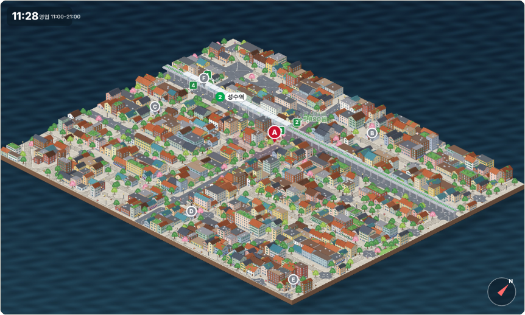
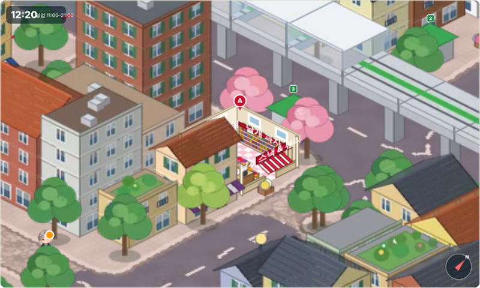
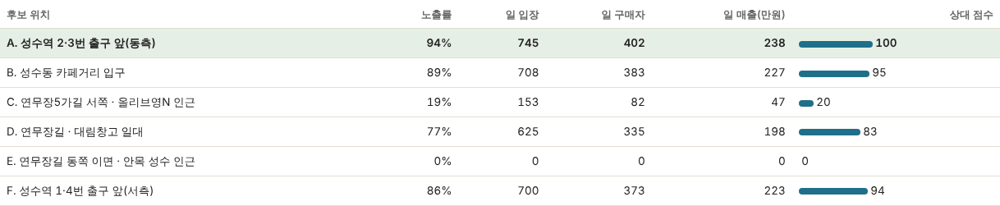

# 성수동2가 신규 점포 입지 시뮬레이션

> **롯데 계열 소포장(낱개) 간식 + 소용량 화장품 가게**를 성수동2가에 낸다면, **진출해도 되는가**와 **어느 자리가 유리한가**를 검토한 멘토 과제입니다.
> 성수동2가를 **등각(아이소메트릭) 도시 모델**로 만들고, 16명의 페르소나 캐릭터가 그 거리를 걸어 다니며 후보지 6곳의 가게를 얼마나 마주치고, 들어오고, 사는지 비교합니다. 가게 안으로 들어가는 모습은 단면으로 보입니다.


| 도시 전체 | 점포 단면(선택한 점포로 이동) |
|---|---|
|  |  |

## 멘토님이 확인하실 곳

| 보고 싶은 것 | 위치 |
|---|---|
| **시뮬레이션 실행** | [`index.html`](index.html) (아래 '실행 방법') |
| **위치 선정 근거 · 타겟 고객 · 마케팅 · 손익분기** | [`보고서.md`](보고서.md) |
| 코엑스→성수 변경 이유, 상권 데이터 분석 | 이 README 아래쪽 / [`보고서.md`](보고서.md) 1~2장 |
| 상권 데이터 분석 코드 / 결과 | [`analysis_seongsu.py`](analysis_seongsu.py) / [`data/analysis_seongsu.json`](data/analysis_seongsu.json) |
| 시뮬레이션 수치(후보지별, 민감도) | [`data/sim_numbers_seongsu.json`](data/sim_numbers_seongsu.json) |

### 실행 방법
- **GitHub Pages (저장소 Settings → Pages에서 켠 경우):** `https://kwak0316k-000.github.io/Capstone/성수동2가_신규점포_입지_시뮬레이션/index.html`
- **로컬:** 저장소를 내려받아 이 폴더의 `index.html`을 브라우저로 열기 (같은 폴더의 `assets/` 필요, 설치 불필요)
- GitHub 화면에서 `index.html`을 열면 코드만 보이고 실행되지 않습니다.

화면에서 할 수 있는 것: 후보 위치 고르기 → ▶ 재생(속도 조절) → 마우스 드래그·휠로 화면 이동·확대('선택한 점포로 이동' 버튼) → 가게를 본 사람 / 들어온 사람 / 구매한 사람 / 매출 확인. 슬라이더로 외국인 비율, 입장률, 구매율, 객단가를 바꾸면 다시 계산하고, 아래 **'비교 계산'** 버튼으로 6곳을 한 번에 비교합니다.

## 과제 요구사항과 대응

| 요구사항 | 이 저장소에서 |
|---|---|
| 에이전트가 돌아다니는 도시 배경(도시 모델링) | 성수동2가 445m×355m를 등각 도시 모델로 제작(건물·가로수·2호선 고가와 열차·출구 4곳). 캐릭터 16명이 길 위를 걷고 점포 단면 안으로 들어가 구매 (`index.html`) |
| 상권분석 데이터에 맞춘 점포 위치 | 후보지 6곳(성수역 출구 앞, 카페거리 입구, 연무장길 등)에 점포를 세워 비교 |
| 신규 점포 최적 위치 + 근거 | 시뮬레이션 비교 + 정성 판단표 (`보고서.md` 3장) |
| 주요 타겟 고객 | `보고서.md` 6장 |
| 맞춤 마케팅 | `보고서.md` 7장 |
| 지표: 방문수, 매출 | 후보지별 노출·입장·구매자·매출, 손익분기 유입 인원 (`보고서.md` 3·5장) |
| 1차 목적: 상권 진출 가능 여부 | **조건부 진출 가능, 단기 팝업으로 먼저 검증** (`보고서.md` 0장) |

## 결과 요약

**결론: 조건부 진출 가능. 정식 입점보다 성수역 2·3번 출구 앞 또는 연무장길(대림창고 일대)의 6~8주 소형 팝업으로 먼저 검증하는 것을 권합니다.**



일 유입 1만 명당 기준, 5회 반복 평균입니다.

| 후보 | 위치 | 노출률 | 일 구매자 | 일 매출(만원) |
|---|---|---|---|---|
| **A** | 성수역 2·3번 출구 앞(동측) | 94% | 402 | 238 |
| **B** | 성수동 카페거리 입구 | 89% | 383 | 227 |
| **F** | 성수역 1·4번 출구 앞(서측) | 86% | 373 | 223 |
| **D** | 연무장길 · 대림창고 일대 | 77% | 335 | 198 |
| **C** | 연무장5가길 · 올리브영N 인근 | 19% | 82 | 47 |
| **E** | 연무장길 동쪽 이면 | 0% | 0 | 0 |

- 입구·목적지 가중치를 ±60% 흔들어 40번 반복했을 때 A가 33번 1위(B 5번, F·D 각 1번)였고, 상위(A·B·F·D)와 하위(C·E) 구분이 유지됐습니다. A·B·F의 차이는 5% 안팎이라 순서는 의미를 두지 않는 것이 안전합니다.
- **E가 0%인 것은** 동쪽(건대입구 방향) 유입을 데이터가 없어 넣지 않았기 때문에, 가정한 입구와 목적지 사이 경로가 E를 지나지 않는 결과입니다. 'E에 사람이 없다'는 뜻이 아닙니다.
- 월 고정비 2,500만원(예시)이면 A 앞으로 하루 약 1.15만 명이 지나가야 손익분기입니다. **실제 통행량은 데이터에 없어 현장 확인이 필요합니다.**
- 주 타겟은 20대(지수 118)와 30대(지수 122), 보조 타겟은 외국인 관광객입니다.

## 왜 코엑스에서 성수로 바꿨나

처음 후보였던 코엑스는 서울시 '길단위인구' 데이터가 **건물 안 몰 방문자를 길 위 측정으로 잡지 못해** 방문수·매출을 추정하기 어려웠습니다. 성수는 거리형 상권이라 데이터가 방문 규모를 어느 정도 반영하고, 연령 구성도 콘셉트의 주 구매층(20~30대)에 더 가깝습니다.

| 항목 | 코엑스 | 성수 |
|---|---|---|
| 길단위 유동인구(2026 Q1) | 48,674명 (1,649곳 중 **1,536위**) | 성수역 1,410,766명(**278위**), 성수동카페거리 1,077,930명(**427위**) |
| 데이터가 방문 규모를 반영하는가 | 거의 못 함 | 어느 정도 반영 |
| 20대 / 30대 / 10대 지수 | 97 / 131 / 62 | 118 / 122 / 88 |
| 주 타겟(20~30대)과의 일치 | 30대 직장인 위주 | 20~30대가 고르게 많음 |

## 성수 상권 데이터 분석 (요약)

서울시 상권분석서비스 '길단위인구-상권'(2026년 1분기)에서 성수 6개 상권을 이름으로 골랐습니다(좌표가 없어 경계는 확인하지 못했고, 성수동카페거리를 연무장길 일대로 본 것은 이름에 따른 추정입니다). 코드: [`analysis_seongsu.py`](analysis_seongsu.py), 결과: [`data/analysis_seongsu.json`](data/analysis_seongsu.json).

| 상권 | 길단위 유동인구 | 전체 순위(1,649곳) | 2021년 1분기 대비 | 전년 동기 대비 |
|---|---|---|---|---|
| 뚝섬역 | 2,393,932 | 74 | +23.3% | 0.0% |
| 성수역 | 1,410,766 | 278 | +12.8% | +5.6% |
| 성수동카페거리 | 1,077,930 | 427 | **+20.0%** | **+7.6%** |
| 성수대교남단 | 731,626 | 642 | −11.4% | −8.1% |
| 서울숲카페거리 | 313,129 | 1,083 | −50.2% | −13.5% |
| 서울숲역 | 233,345 | 1,204 | +2.4% | +8.5% |

- **성수역·성수동카페거리는 성장 중**이고 서울숲 쪽은 규모가 작고 줄고 있어, 후보지를 성수동2가(성수역·연무장길)로 한정한 판단과 데이터가 맞습니다.
- 6곳 합산 지수(서울 발달상권 평균=100): **20대 118, 30대 122**로 강하고 10대 88, 50대 85, 60대 이상 73으로 중장년은 약합니다. 시간대는 11~14시 119, **14~17시 125**, 17~21시 106으로 낮~저녁이 강하고 심야는 약합니다(00~06시 71).
- 토·일 비중은 23.9%로 발달상권 평균(26.0%)보다 낮습니다. 길단위 인구에 직장인·주민이 섞여 있어서로 짐작되며, 이 데이터만으로 주말 방문객이 적다고 결론 내리면 안 됩니다.
- 보도 기준 2024년 성수동 방문객은 약 2,900만 명, 외국인은 300만 명 이상이며 팝업은 성수동2가3동 연무장길에 집중됩니다(출처 참고). 자세한 표와 해석은 [`보고서.md`](보고서.md) 1~2장에 있습니다.

## 어떻게 만들었나

1. **상권 데이터:** 서울시 상권분석서비스 '길단위인구-상권'(2021 Q1~2026 Q1)에서 성수 6개 상권을 골라 연령대·시간대·추세를 서울 발달상권 평균(=100) 대비 지수로 계산했습니다.
2. **상권 변경:** 처음 후보였던 코엑스는 길단위 데이터가 건물 안 방문자를 못 잡아 성수로 바꿨습니다.
3. **캐릭터:** 이전 과제의 16명을 에이전트로 사용합니다. 연령 구성은 성수 상권의 연령 비율대로 뽑습니다.
4. **도시 모델과 길:** 구글맵 캡처에서 도로·블록·공원의 윤곽과 2호선 고가 위치를 추출해 지형을 만들고(`iso_ground.py`), 블록 안에 건물·가로수·가로등을 규칙에 따라 세웠습니다(`iso_build.py`). 길 그래프(노드 582개)도 같은 윤곽에서 만들며(`iso_graph.py`) 캐릭터는 이 길 위만 걷습니다. **건물 자체는 가상**이고, 실제와 같은 것은 길·블록·공원의 윤곽과 고가철도·출구의 위치입니다.
5. **이동:** 입구에서 들어와 목적지(대림창고, 카페거리 등)를 1~3곳 들르고 나갑니다. 방문 시각은 상권의 시간대 비율을 따릅니다.
6. **구매:** 가게 반경(약 50m)을 지나가면 '알아봄' → 입장 확률(연령·성별·외국인에 따라 다름) → 구매 확률 → 객단가.
7. **공정한 비교:** 모든 후보지에 같은 방문자 표본을 적용하고, 입구·목적지 가중치를 흔들어 순위가 얼마나 안정적인지 확인했습니다.

## 가정과 한계 (먼저 읽어주세요)

**데이터에서 온 값:** 연령대 구성, 시간대별 방문 비중, 입구별 유입 비율(상권 유동인구에 비례).
**가정한 값:** 목적지 가중치, 기본 입장률 8%, 구매율 55%, 객단가 6,000원, 외국인 입장 배수, 알아보는 반경, 성수역 출구 4곳에 유입 **균등 배분**.

- 숫자의 크기보다 **후보지 사이의 상대 비교**로 읽어주세요. 절대 방문수·매출은 추정하지 않았습니다.
- 출구 바로 앞 후보(A, F)는 그 출구로 나온 사람이 모두 지나가는 구조라 노출이 높게 나옵니다. A와 F의 차이는 의미 있는 차이로 보지 않는 것이 안전합니다.
- 동쪽(건대입구 방향) 유입은 데이터가 없어 넣지 않았습니다.
- **건물의 층수·색·지붕·점포 외관은 가상입니다.** 길은 지도 이미지에서 자동 추출한 것이라 일부 골목이 끊기거나 잘못 잡혔을 수 있습니다. 건물 출입구·골목 폭·횡단보도는 반영되지 않았습니다.
- 임대료, 경쟁 점포, 간판 가시성, 팝업 방문객의 실제 구매 행태는 모델에 없습니다.
- 사용하지 못한 데이터: 서울시 상권분석서비스 **추정매출**. 있으면 손익분기 계산을 실제 매출 기반으로 바꿀 수 있습니다.
- 식품 소분 영업 등록, 맞춤형화장품 판매업 신고 등 **규정 확인이 필요**합니다(`보고서.md` 8장).
- 엔터테인먼트사 협업 아이디어는 근거가 불충분해 이번 과제에서 제외했습니다.

<details>
<summary>폴더 구조</summary>

```
성수동2가_신규점포_입지_시뮬레이션/
├─ index.html                 시뮬레이션 (브라우저에서 바로 실행)
├─ 보고서.md                  진출 판단, 위치 근거, 임대 환경, 손익분기, 타겟, 마케팅
├─ analysis_seongsu.py        성수 6개 상권 데이터 분석
├─ geo.py                     지도 캡처에서 도로·블록·공원·2호선 윤곽 추출
├─ iso_ground.py              지형(바닥) 텍스처 생성
├─ iso_build.py               건물·점포·가로수·고가 생성, 이미지 아틀라스 제작
├─ iso_draw.py, iso_common.py 건물 그리기, 등각 투영 공통 함수
├─ iso_graph.py               길 그래프·입구·목적지 생성
├─ iso_sim.js, iso_page.py    화면·시뮬레이션 코드, index.html 조립(index_old.html은 화면 틀)
├─ assets/
│  ├─ ground.jpg              도시 모델 바닥(등각)
│  ├─ atlas.webp              건물·가로수·점포 이미지 모음
│  └─ sprites/                캐릭터 16명
├─ data/
│  ├─ analysis_seongsu.json   상권 분석 결과
│  ├─ sim_numbers_seongsu.json 시뮬레이션 수치
│  ├─ scene.json              도시 모델 객체(건물·점포·출구 좌표)
│  ├─ iso_graph.json          길 그래프
│  └─ map_src.png             원본 지도 캡처
└─ docs/                      README용 화면
```
</details>

<details>
<summary>다시 만들려면</summary>

```bash
# 상권 분석 (서울시 상권분석서비스 CSV 필요)
python analysis_seongsu.py 서울시_상권분석서비스_길단위인구-상권_.csv

# 도시 모델 생성 → 길 그래프 → 페이지 조립
python3 iso_ground.py
python3 iso_build.py
python3 iso_graph.py
python3 iso_page.py        # index.html 생성
```
scikit-image, opencv-python, scipy, networkx, Pillow, numpy가 필요합니다.
</details>

## 출처
- 서울시 상권분석서비스 길단위인구-상권 (data.seoul.go.kr, 2026년 1분기)
- [다음뉴스: 성수 골목 누비는 외국인](https://v.daum.net/v/G6jGiJfzj9?f=p) — 2024년 방문객·외국인 규모
- [경향신문 2024-03-03: 성수 팝업 젠트리피케이션](https://www.khan.co.kr/article/202403030700001) — 연무장길 팝업 집중, 임대료·권리금
- [팝업코리아: 연무장길 팝업 공간](https://www.popupkorea.co.kr/popup_store/300?sop=and) — 팝업 대관료
- 배경 지도: Google Maps 캡처(학습·과제용), 지도 데이터 ©TMap Mobility
