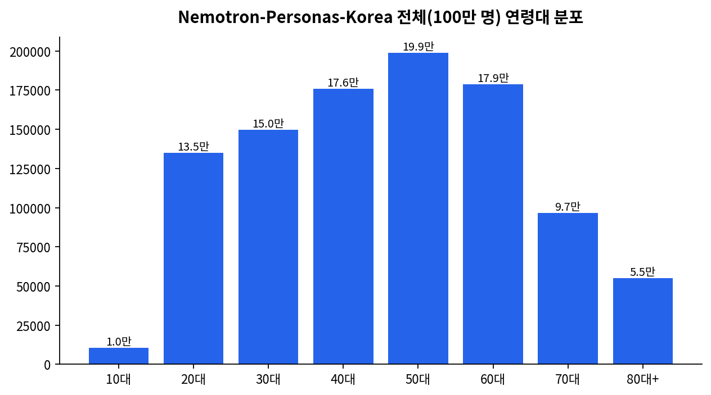
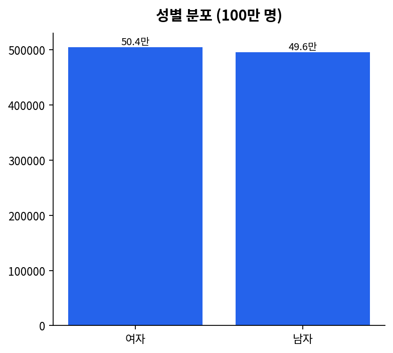
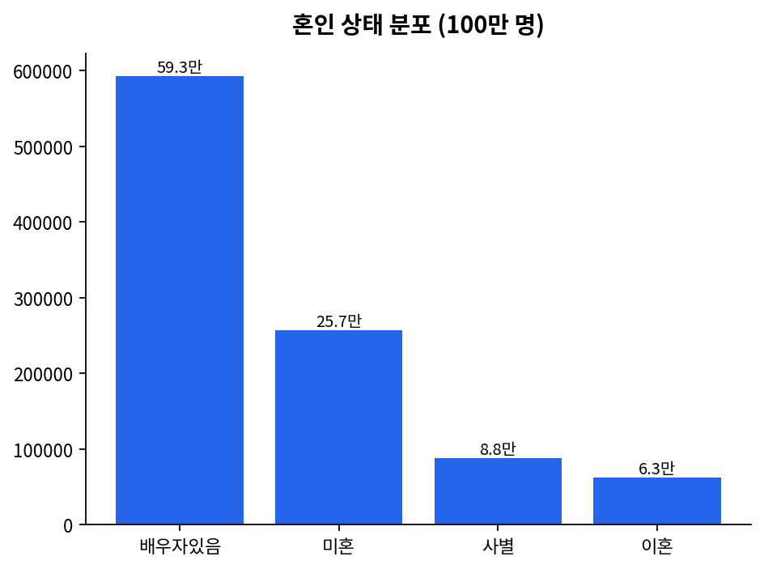
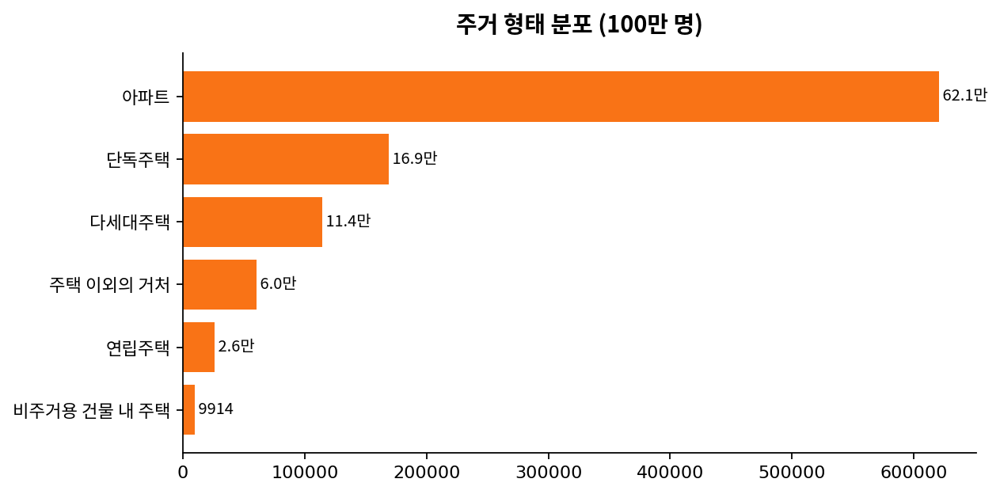
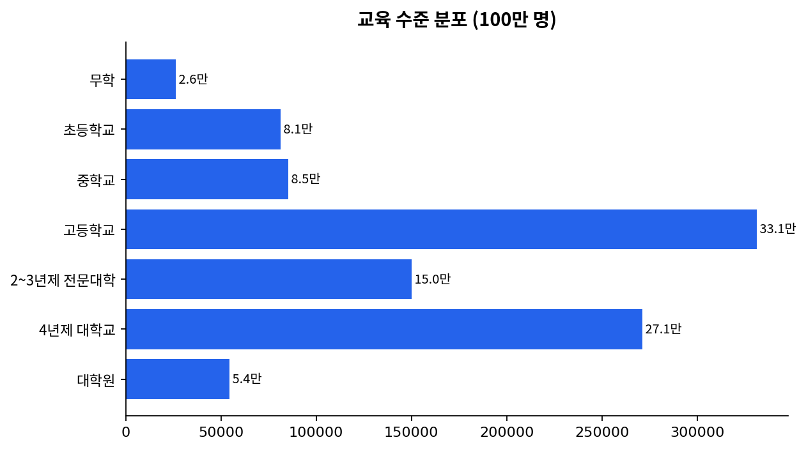
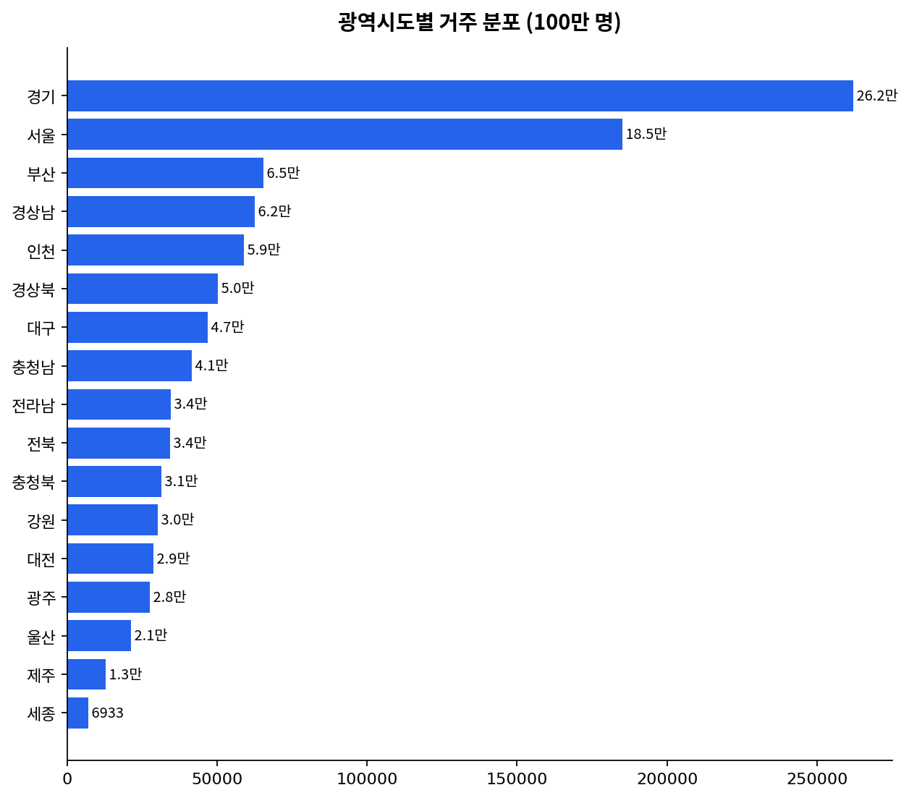
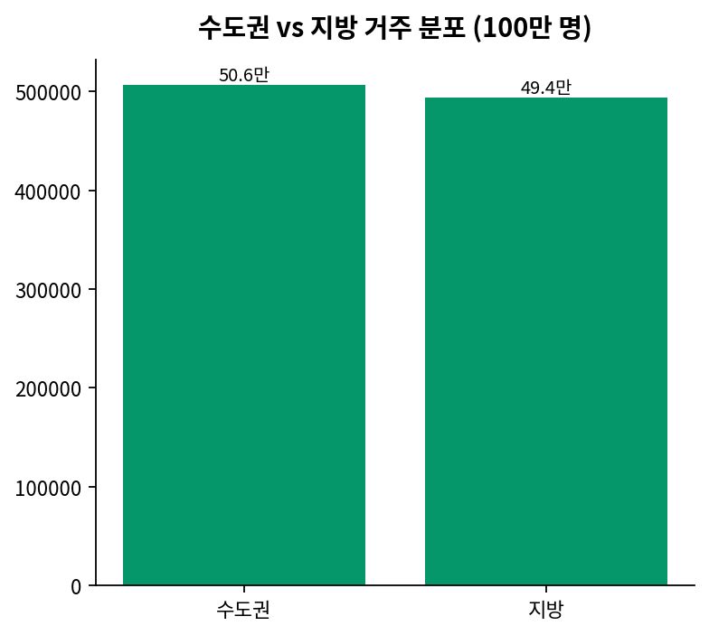
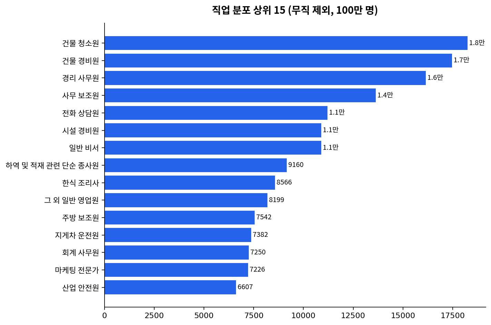
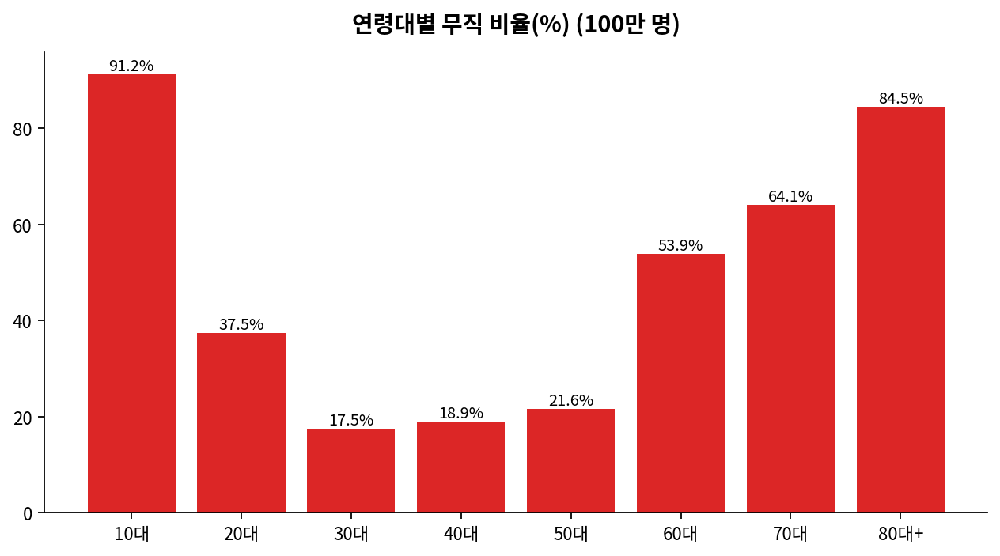

# nvidia/Nemotron-Personas-Korea 데이터셋 EDA (전체 100만 명)

> [huggingface.co/datasets/nvidia/Nemotron-Personas-Korea](https://huggingface.co/datasets/nvidia/Nemotron-Personas-Korea) — NVIDIA가 KOSIS(통계청), 대법원 이름 통계, 국민건강보험공단, 한국농촌경제연구원 자료를 기반으로 생성한 100만 명 규모의 한국 합성 페르소나 데이터셋. Probabilistic Graphical Model + Gemma-4-31B 하이브리드 파이프라인으로 생성되었다(NVIDIA 공식 블로그 기준).

본 문서는 **전체 100만 명**을 대상으로 한 EDA다. (이전에 작성했던 500명 샘플 버전은 방향성이 거의 동일했음이 아래에서 확인된다 — 두 버전을 비교하는 내용도 §9에 남겨둔다.)

---

## 1. 데이터셋 개요

| 항목 | 내용 |
|---|---|
| 분석 대상 | 전체 1,000,000명 (인구통계 필드만 추출, 서술형 페르소나 텍스트는 제외) |
| 연령 범위 | 19세 ~ 99세 |
| 지역 커버리지 | 전국 17개 광역시도 전부 포함 |
| 데이터 출처(공식 문서 기준) | KOSIS(통계청 성별·지역·산업·직업·여행/여가 통계), 대법원(출생연도·성별·이름), 국민건강보험공단, 한국농촌경제연구원, NAVER Cloud(시드 데이터) |

## 2. 연령 분포

<p align="center">
  
</p>

| 연령대 | 인원 | 비율 |
|---|---|---|
| 10대(19세만) | 10,491 | 1.05% |
| 20대 | 135,011 | 13.50% |
| 30대 | 149,659 | 14.97% |
| 40대 | 175,647 | 17.56% |
| 50대 | 198,750 | 19.88% |
| 60대 | 178,738 | 17.87% |
| 70대 | 96,558 | 9.66% |
| 80대+ | 55,146 | 5.51% |

평균 연령 50.66세, 중앙값 51세. 500명 샘플에서 관찰한 것과 동일하게 50대가 최대 비중(19.88%)이며, 전체적으로 실제 한국의 고령화된 인구구조를 반영한 종형에 가까운 분포다. 데이터셋은 대한민국 성인 연령(만 19세) 기준으로 설계되어 미성년자는 포함하지 않는다.

## 3. 성별 분포

<p align="center">
  
</p>

여자 504,442명(50.44%), 남자 495,558명(49.56%) — 거의 정확히 반반이다.

## 4. 혼인 상태 & 가구 형태

<p align="center">
  
</p>

| 혼인상태 | 인원 | 비율 |
|---|---|---|
| 배우자 있음 | 592,538 | 59.25% |
| 미혼 | 256,962 | 25.70% |
| 사별 | 87,888 | 8.79% |
| 이혼 | 62,612 | 6.26% |

성별 교차표:

| | 미혼 | 배우자있음 | 사별 | 이혼 |
|---|---|---|---|---|
| 남자 | 152,871 | 299,756 | 13,545 | 29,386 |
| 여자 | 104,091 | 292,782 | 74,343 | 33,226 |

**여성의 사별 비율은 74,343/504,442 = 14.74%, 남성은 13,545/495,558 = 2.73%로 5.4배 차이난다.** 500명 샘플에서 관찰했던 "여성 사별률이 압도적으로 높다"는 경향이 전체 데이터에서도 그대로 재현되며, 오히려 표본(8배 차이)보다는 다소 완화된 격차(5.4배)로 정확도가 더 높다 — 실제 한국의 성별 기대수명 격차(여성이 남성보다 약 6년 김)를 반영한 설계로 보인다.

## 5. 주거 형태

<p align="center">
  
</p>

아파트 거주가 620,556명(62.06%)으로 가장 많다.

## 6. 교육 수준

<p align="center">
  
</p>

| 교육수준 | 인원 | 비율 |
|---|---|---|
| 고등학교 | 331,377 | 33.14% |
| 4년제 대학교 | 271,256 | 27.13% |
| 2~3년제 전문대학 | 150,235 | 15.02% |
| 중학교 | 85,255 | 8.53% |
| 초등학교 | 81,239 | 8.12% |
| 대학원 | 54,323 | 5.43% |
| 무학 | 26,315 | 2.63% |

## 7. 거주지 분포

<p align="center">
  
</p>

| 순위 | 광역시도 | 인원 | 비율 |
|---|---|---|---|
| 1 | 경기 | 262,154 | 26.22% |
| 2 | 서울 | 185,228 | 18.52% |
| 3 | 부산 | 65,285 | 6.53% |
| 4 | 경상남 | 62,416 | 6.24% |
| 5 | 인천 | 58,991 | 5.90% |

<p align="center">
  
</p>

수도권(서울·경기·인천) 506,373명(**50.64%**) vs 지방 493,627명(49.36%). 실제 통계청 기준 대한민국 수도권 인구 비중(2024년 기준 약 50.7%)과 **거의 정확히 일치**한다 — KOSIS 마진(marginal) 정합성이 매우 높다는 걸 보여주는 대목이다.

## 8. 직업 분포

<p align="center">
  
</p>

전체의 **36.73%(367,349명)가 "무직"**이다. 무직을 제외한 상위 직업은 건물 청소원(18,253명), 건물 경비원(17,473명), 경리 사무원(16,146명), 사무 보조원(13,630명), 전화 상담원(11,211명) 순으로, 500명 샘플에서 관찰했던 "생활 밀착형·서비스직 비중이 높다"는 경향이 그대로 유지된다.

### 연령대별 무직 비율

<p align="center">
  
</p>

| 연령대 | 무직 비율 |
|---|---|
| 10대 | 91.23% |
| 20대 | 37.46% |
| 30대 | 17.50% |
| 40대 | 18.92% |
| 50대 | 21.59% |
| 60대 | 53.91% |
| 70대 | 64.12% |
| 80대+ | 84.52% |

U자형 곡선이 500명 샘플보다 훨씬 매끄럽고 안정적으로 나타난다(표본오차가 줄어든 결과). 30대에서 무직 비율이 최저(17.50%)를 찍고, 60대부터 급격히 상승하는 패턴은 실제 한국 노동시장의 생애주기와 부합한다.

## 9. 병역 상태

994,718명(99.47%)이 비현역, 5,282명(0.53%)이 현역이다. 표본(500명) 대비 현역 비율(1.0%)이 실제 전체(0.53%)보다 다소 높게 나왔던 것으로 미루어, **표본 크기가 작을수록 소수 카테고리(현역, 세종 거주 등)의 오차가 커진다**는 통계학적으로 당연한 사실이 재확인된다.

---

## 10. 500명 표본 vs 100만 명 전체 비교

이전에 작성한 500명 표본 EDA가 실제로 얼마나 정확했는지 검증해봤다.

| 지표 | 500명 표본 | 100만 명 전체 | 오차 |
|---|---|---|---|
| 무직 비율 | 35.2% | 36.73% | 1.53%p |
| 수도권 비율 | 49.4% | 50.64% | 1.24%p |
| 여성 비율 | 48.6% | 50.44% | 1.84%p |
| 배우자있음 비율 | 61.8% | 59.25% | 2.55%p |
| 현역 비율 | 1.0% | 0.53% | 0.47%p |
| 아파트 거주 비율 | 66.4% | 62.06% | 4.34%p |

500명이라는 상대적으로 작은 표본임에도 대부분의 지표가 실제 전체값과 2%p 이내로 근접했다. 이는 통계학적으로 자연스러운 결과다 — 무작위 표본 500개면 비율 추정의 95% 신뢰구간 오차범위가 대략 ±4.4%p 수준이고, 실제 관측된 오차들이 대체로 이 범위 안에 들어온다. 다만 "아파트 거주 비율"처럼 오차가 4%p를 넘는 항목도 있어, **표본 하나로 전체를 완벽히 대변한다고 보기는 어렵다**는 것도 함께 확인된다.

## 11. 종합 소견

1. **KOSIS 공식 통계와의 마진(marginal) 정합성이 매우 높다** — 특히 수도권/지방 비율(50.64%)은 실제 통계청 수치와 거의 정확히 일치한다.
2. **여성의 사별률이 남성보다 5.4배 높다**는 등, 성별·연령에 따른 현실적인 생애주기 패턴이 잘 반영되어 있다.
3. **직업 분포는 화이트칼라보다 생활 밀착형·서비스·단순노무직에 크게 치우쳐 있다**(무직 36.7% + 청소/경비/사무보조 등 상위 직업군). 이는 실제 한국 취업자 구조를 반영한 결과로 보이나, 후속 검증이 필요하다.
4. 다만 공개된 제3자 검증 연구(§12 참고)에 따르면, **개별 변수(marginal)는 잘 맞아도 변수 간 결합분포(joint distribution)는 실제 통계와 어긋나는 경우가 있다** — 예를 들어 "전공×직업" 조합이 한국고용정보원(KEIS) 졸업생 통계와 크게 다르다는 점이 지적되었다. 즉 "이 사람 성별과 나이만 보면 실제와 비슷하지만, 그 사람의 전공과 실제로 얻은 직업의 관계까지는 신뢰하기 어렵다"는 뜻이다.

## 12. 참고 — 제3자 검증 연구

Bae et al., *"Marginal Alignment Does Not Guarantee Joint-Distribution Fidelity: An Official-Reference Audit of Nemotron-Personas-Korea with Cross-Locale Replication"* (arXiv:2606.12433)는 이 데이터셋(100만 명 버전) 전체를 KOSIS 등 공식 통계와 대조 감사한 논문이다. 핵심 결론:

- 데이터셋 카드 자체가 "성별·소득·교육·전공이 직업 배정에 독립적으로 작용하며, 상호작용 효과는 모델링하지 않았다"고 명시
- 단변량 주변분포는 KOSIS와 정합하나, 검증한 3개 결합분포 중 특히 "전공×직업" 조합에서 KEIS(한국고용정보원) 졸업생 통계 대비 큰 불일치가 발견됨

이는 우리가 본 EDA에서 관찰한 "마진은 정확하다"는 결론과 정확히 일치하며, 동시에 **"성별이나 지역처럼 하나의 변수만 볼 때는 믿을 만하지만, 두 개 이상의 속성을 조합해서 해석할 때는 주의가 필요하다"**는 중요한 한계를 알려준다.

---

## 13. 재현 방법

### 13.1 전체 데이터셋 다운로드 (Colab, 네트워크 필요)
```python
from datasets import load_dataset
import pandas as pd

ds = load_dataset("nvidia/Nemotron-Personas-Korea", split="train")
cols = ['sex', 'age', 'marital_status', 'military_status', 'family_type',
        'housing_type', 'education_level', 'bachelors_field', 'occupation',
        'district', 'province']
df = ds.to_pandas()[cols]
df.to_csv("nemotron_full_1M_demographics.csv", index=False, encoding="utf-8-sig")
```

### 13.2 EDA 차트 생성
```bash
python nemotron_eda_full.py --csv nemotron_full_1M_demographics.csv
```
