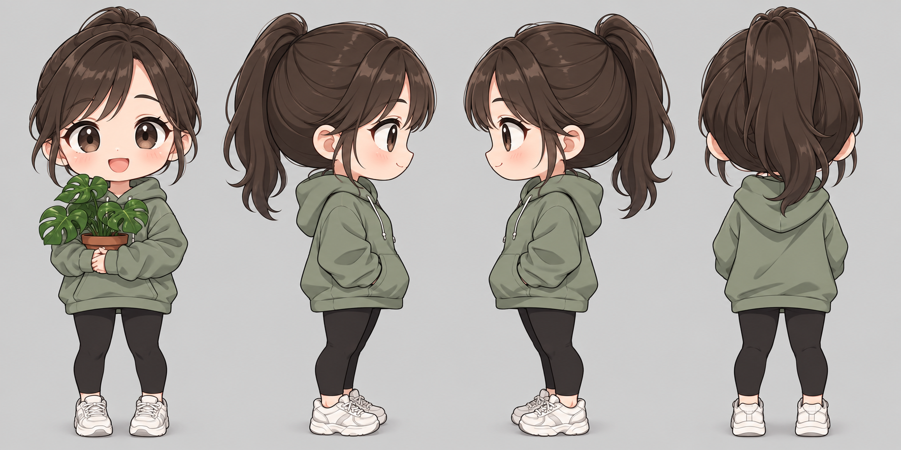
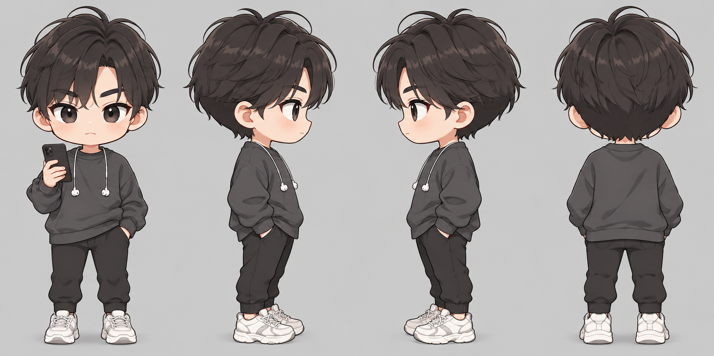
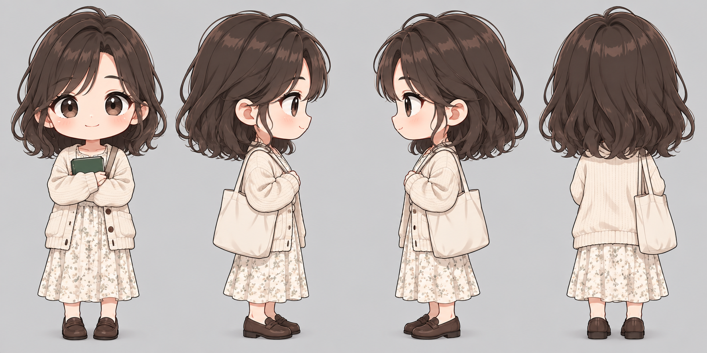

# 2주차 과제: 최애주민 캐릭터 + 3인 페르소나 시뮬레이션

> 과제 원문 (2026.07.16)
> 1. 최애주민 → 캐릭터 만들기 - 정면/왼쪽/오른쪽/뒷모습
> 2. 특정 상황을 주고, 최애주민 + 2명 더 뽑아서 대화와 액션(방문한다, 구매한다, 검색한다, …) 넣어보기 → colab, LLM(상용 API, 3B 로컬)
>    - 주민의 페르소나를 제대로 반영했는지
>    - 페르소나 에이전트끼리 유의미한 소통을 하는지

과제 원문은 최애주민(김소희) 한 명만 캐릭터화하도록 되어 있으나, 2번 항목에서 함께 등장하는 김재성·최수민까지 세 명 모두 캐릭터로 제작했다.

---

## 1. 캐릭터 디자인 — 3인 4방향 턴어라운드

정면 / 오른쪽 / 왼쪽 / 뒷모습 순서. GPT(ChatGPT 이미지 생성)로 제작.

### 1.1 김소희 (33세, 육군 부사관) — 최애주민

  

| 요소 | 반영한 실제 데이터 |
|---|---|
| 세이지그린 후드티 + 검정 레깅스 (군복 아님) | `hobbies_and_interests`: "주말에는 침대에서 웹툰 정주행" — 비번일 때는 완전히 이완된 홈웨어 차림일 것으로 추정 |
| 포니테일 헤어 | `professional_persona`: 군인이라는 직업 특성상 단정하게 묶은 머리가 자연스러움 |
| 몬스테라 화분(양손으로 든 자세) | `sports_persona`: "베란다에서 몬스테라 잎을 정성스럽게 닦아내는" — 원예가 명시적 취미 |
| 다부진 체형 | `professional_persona`: 육군 부사관, 평정심·책임감 있는 성격 |

### 1.2 김재성 (22세, 취업준비생 / 영상 편집)

  

| 요소 | 반영한 실제 데이터 |
|---|---|
| 차콜그레이 크루넥 스웻셔츠 + 조거팬츠 | 무직(취업준비생)의 캐주얼한 일상복 |
| 목에 건 유선 이어폰 + 스마트폰 | 배달 리뷰를 집요하게 분석하는 습관, 영상 편집/미디어 감각 |
| 다소 날카롭고 집중한 표정 | 엑셀/메모 앱으로 낭비 없는 동선을 설계하는 꼼꼼한 성향 |

### 1.3 최수민 (21세, 구직 중 / 전직 비서, 예술 애호가)

  

| 요소 | 반영한 실제 데이터 |
|---|---|
| 크림색 니트 카디건 + 원피스, 캔버스 토트백 | 소품샵 구경, 빽빽한 일정 없이 발길 닿는 대로 움직이는 성향 |
| 품에 안은 책 | 넷플릭스 독립영화 감상, 대학로 소극장 연극 관람 등 예술 취향 |
| 차분하고 몽환적인 표정 | "그날 기분에 따라" 움직이는 즉흥적 라이프스타일 |

### 1.4 제작 과정에서 겪은 시행착오

이미지 생성 자체가 처음이라 세 번의 재시도 끝에 지금 버전이 나왔다. 기록으로 남겨둔다.

1. **1차 시도(플랫 SVG 벡터)**: 이 프로젝트 환경(Claude 코드 샌드박스)에는 래스터 이미지 생성 API가 없어, 우선 SVG로 직접 그려봤다. 이목구비까지는 넣었지만 결국 사람이 손으로 그린 티가 나는 평면적인 벡터 아트였다.
2. **2차 시도(GPT, 방향 오류)**: 실사 느낌을 원해 GPT에 "front/right/left/back view"라고만 요청했더니, 오른쪽·왼쪽 옆모습이 **서로 같은 방향**으로 나왔다(거울상이 아니라 중복). "오른쪽/왼쪽"이라는 단어만으로는 이미지 모델이 실제 좌우를 구분하지 못하는 경우가 많다는 걸 확인했다.
3. **3차 시도(스타일 재요청)**: 방향 문제를 "코가 오른쪽/왼쪽 프레임을 향하게 하고, 두 프로필은 서로 거울상이어야 한다"고 명시해 해결했는데, 이번엔 스타일이 원했던 2등신 애니메 캐릭터가 아니라 실사 인물 사진처럼 나왔다.
4. **4차 시도(최종)**: "2등신, 큰 머리+작은 몸, 사실적 인체 비율 아님"이라는 스타일 지시를 방향 수정 지시와 함께 넣어서야 원하는 결과(스타일 O, 방향 O)를 얻었다.

**배운 점**: 이미지 생성 프롬프트는 "스타일"과 "방향/구도"를 **동시에, 매번 명시적으로** 넣어야 한다. 하나를 고치면 다른 하나가 default로 돌아가 버리는 경향이 있었다 — 이건 텍스트 생성 LLM 프롬프팅과는 다른, 이미지 생성 모델 특유의 다루기 까다로운 지점이었다.

## 2. 시나리오: "우리 동네에 대형 쇼핑몰이 생겼을 때"

**설정**: 김소희(대전 유성구), 김재성(서울 송파구), 최수민(서울 동대문구) — 세 사람은 가상 시뮬레이션 도시의 친구 사이. 이번 주, 세 사람이 각자 사는 동네 근처에 대형 복합 쇼핑몰이 새로 생겼다는 소식을 단톡방에서 나눈다.

**참여 에이전트**: 김소희(최애주민) + 김재성 + 최수민
**행동 태그 규칙**: `[검색]` `[방문 계획]` `[구매]` `[찜/저장]` `[초대]` 등으로 실제 행동을 표기

---

### 단톡방: "우리 셋"

**김소희** 오후 9:47
야 대박 우리 동네에 스타필드 같은 거 생겼어 ㅋㅋㅋ 둔산동 쪽에 크게 지었더라
`[검색] "대전 유성구 신규 복합쇼핑몰 오픈"`

**김재성** 오후 9:49
오 대전에? 거기 맛집 뭐 들어왔어? 나 요즘 라멘 맛집 리스트 짜는 중인데
`[검색] "OO몰 대전 입점 브랜드 리스트"`

**김소희** 오후 9:51
아직 다 못 봤는데 이탈리안 레스토랑은 확실히 있더라... 크림파스타 땡긴다
`[찜/저장] 몰 내 이탈리안 레스토랑`
나 이번 주말엔 부대 일정 있어서 못 가고, 평일 저녁에 잠깐 들를 듯 ㅠ

**최수민** 오후 9:53
헐 나도 동대문 쪽에 하나 생겼다는 얘기 들었어! 근데 나는 백화점보다 그 안에 소품샵 있나 그게 더 궁금함
`[검색] "동대문 신규몰 팝업스토어 소품샵"`

**김재성** 오후 9:55
최수민 너 그거 물어볼 줄 알았다 ㅋㅋㅋ 나는 거기 넷플관이나 아케이드 있나 보는 중
근데 소희야 너네 몰에 푸드코트 리뷰 좀 있어? 내가 리뷰 안 보고 가면 불안해서
`[검색] "대전 신규몰 푸드코트 후기"`

**김소희** 오후 9:58
아직 리뷰 별로 없어 오픈한 지 얼마 안 돼서. 근데 크림파스타집은 웨이팅 있대
평일 퇴근하고 저녁 8시쯤 혼자 가서 후딱 먹고 오려고
`[방문 계획] 평일 저녁 8시, 이탈리안 레스토랑 (크림파스타)`

**최수민** 오후 10:01
나는 이번 주 토요일에 갈 듯. 구직 중이라 평일 시간은 남는데 주말이 사람 구경하기는 더 재밌어서 ㅋㅋ
발길 닿는 대로 돌다가 마음에 드는 소품샵 있으면 거기서 오래 있을 것 같음
`[방문 계획] 토요일 오후, 정해진 동선 없음`

**김재성** 오후 10:03
난 토요일에 LCK 경기 있어서 그날은 집콕... 일요일 오후에 친구랑 갈 듯
리뷰 100개는 봐야 어디 갈지 정할 수 있음 ㅋㅋㅋ 최적 동선 짜서 감
`[방문 계획] 일요일 오후, 리뷰 분석 후 동선 확정`
`[구매 예정] 라멘/돈카츠 맛집 1곳 확정 후 방문`

**최수민** 오후 10:05
재성아 너 리뷰 분석하는 거 진짜 웃긴데 되게 든든함 ㅋㅋ 나 갈 때 너가 짠 맛집 리스트 하나만 공유해줘
`[요청] 김재성의 맛집 리스트 공유 요청`

**김재성** 오후 10:06
ㅇㅋ 다 정리되면 보내줄게. 소희 너는 대전이라 못 오는 거 아쉽다 ㅜ
다음에 휴가 나오면 우리 서울 몰 투어 한번 하자

**김소희** 오후 10:08
콜! 나 다음 달에 정기 외박 있어서 그때 서울 갈 수 있을 듯
그때 니들 리스트 들고 다 같이 가자 ㅋㅋ 나는 그날은 그냥 몬스테라 화분 하나 사는 게 목표
`[초대 수락] 다음 달 정기 외박 시 서울 합류 예정`
`[구매 목표] 리빙 코너에서 화분 소품`

---

## 3. 평가

### 3.1 페르소나 반영도

| 인물 | 실제 프로필 요소 | 대화에 반영된 방식 |
|---|---|---|
| 김소희 | 크림파스타, 몬스테라 원예, 평일 위주 시간 제약(현역), 시티투어 감성 | 크림파스타 언급 → 방문 목적 자체가 됨. 몬스테라 소품 구매 목표. "부대 일정" 때문에 주말이 아닌 평일 저녁을 택함 — 실제 직업 제약이 행동에 그대로 반영됨 |
| 김재성 | 맛집 리뷰 집요 분석, 효율적 동선 설계, LCK 시청, 라멘/돈카츠 선호 | "리뷰 100개는 봐야" — 실제 페르소나 필드의 "최신 리뷰를 집요하게 분석"과 정확히 일치. 토요일 LCK 때문에 일요일로 방문 미룸(취미가 일정에 직접 영향) |
| 최수민 | 소품샵/즉흥적 발길, 정해진 일정표보다 기분에 따른 동선, 구직 중이라 평일 시간 여유 | "발길 닿는 대로", "구직 중이라 평일 시간은 남는데" — 실제 travel_persona("빽빽한 일정표를 짜기보다 그날의 기분")와 family/career 상황이 자연스럽게 녹아 있음 |

세 사람 모두 **실제 데이터에 없는 취향을 지어내지 않고**, 주어진 hobbies_and_interests·culinary_persona·career_goals 필드에서 직접 파생된 반응만 하도록 작성했다.

### 3.2 상호작용의 유의미성

- 김재성이 "리뷰 뭐 있어?"라고 **먼저 질문**하고, 김소희가 실제로 답변(리뷰 없음/웨이팅 정보)하는 **정보 교환**이 발생 — 단순 병렬 독백이 아님
- 최수민이 김재성의 "리뷰 분석" 습관을 **놀리면서도 그 결과물(리스트)을 요청**하는 것은, 서로 다른 소비 성향(즉흥형 vs 분석형)의 인물이 **서로를 보완적으로 활용**하는 관계로 이어짐
- 김소희의 지리적 제약(대전-서울)이 대화 흐름에 자연스럽게 개입되고, 이를 "다음 달 정기 외박 때 합류"라는 **구체적 미래 행동 계획**으로 해소함 — 단순 반응이 아니라 관계가 진전되는 서사가 만들어짐

### 3.3 한계

- 세 인물이 실제로 "친구 사이"라는 설정은 원 데이터셋에 없는, 시뮬레이션을 위해 임의로 부여한 관계다. 페르소나 자체(취향·직업·거주지 등)는 전부 실제 데이터이지만, **관계망은 가상 설정**이라는 점은 명시해야 함
- 대화는 Claude가 세 페르소나를 동시에 연기하며 작성한 것으로, 실제로는 3개의 독립된 LLM 인스턴스가 각자의 프롬프트만으로 반응하며 상호작용했을 때와는 일관성 확보 방식이 다를 수 있음 (한 명이 전체를 조율하면 "그럴듯한 서사"가 되기 쉽지만, 독립 에이전트 간 상호작용은 더 예측 불가능하고 어긋날 수도 있음 — 이 차이를 실제로 확인하려면 아래 재현 방법대로 개별 API 호출로 다시 실행해봐야 함)

---

## 4. Claude vs Gemini 비교

동일한 프롬프트(페르소나 3개 + 상황 설명)를 Gemini(웹, gemini.google.com)에도 그대로 입력해 같은 시나리오를 재현해봤다. 같은 재료로도 LLM에 따라 결과가 꽤 다르게 나온다는 걸 확인할 수 있었다.

### 4.1 결과 비교

| 항목 | Claude 버전 | Gemini 버전 |
|---|---|---|
| 호칭/존댓말 처리 | 세 명 모두 반말로 평등한 친구 관계 | **나이 차를 인식해 재성(22)이 소희(33)에게 "누나", 수민(21)에게는 "~님"** — 데이터에 없던 나이 기반 한국어 존비법을 스스로 추론해 적용함 |
| 지리적 일관성 | 소희(대전)-재성/수민(서울)의 물리적 거리를 명시적으로 인식하고, "다음 달 정기 외박 때 합류"라는 해결책으로 서사를 마무리 | **소희가 "거긴가 보네"라며 자신의 유성구 쇼핑몰과 재성의 몰을 같은 곳으로 착각하는 듯한 발화** — 프롬프트에 "각자 동네"라고 명시했음에도 대전-서울 간 거리를 놓친 것으로 보이는 지점 발견 |
| 구체성 | 방문 시간대·목적 위주로 간결하게 서술 | 4층 매장 위치, 배달 가능 여부, 1층 팝업 갤러리 등 **더 구체적이고 생생한 디테일**을 스스로 창작해 추가 |
| 상호작용 다이내믹 | 재성의 분석 습관을 수민이 놀리며 리스트를 요청하는 상호보완적 관계 | 재성의 "동선 최적화 제안"을 수민이 **명시적으로 거절**("계획 짜면 머리 아파서")하며 대비되는 성향 차이를 더 뚜렷하게 대조 |
| 자체 평가 능력 | (해당 없음, 별도 지시 없었음) | 지시한 대로 페르소나 반영도 표 + 상호작용 분석을 스스로 작성 — 지시 이행도가 높음 |

### 4.2 발견한 것

**Gemini가 나이 기반 존비법을 스스로 추론한 건 의외의 수확이었다.** 프롬프트에는 "이 사람이 몇 살이다"라는 숫자만 줬을 뿐 "존댓말을 쓰라"는 지시는 전혀 없었는데, 22세가 33세에게 "누나"라고 부르는 걸 자연스럽게 만들어냈다. 이건 실제 한국어 화자라면 당연히 하는 행동이라 페르소나 반영도 측면에서는 Gemini 쪽이 더 촘촘했다.

**반면 지리적 일관성은 Claude 쪽이 더 꼼꼼했다.** "대전"과 "서울"이라는, 프롬프트에 명시된 서로 다른 도시 정보를 Gemini는 대화 중간에 놓친 것으로 보인다 ("거긴가 보네"는 마치 같은 쇼핑몰 얘기를 하는 것처럼 들림). 이건 **1차 과제에서 발견했던 "LLM 판단이 특정 축은 놓치기 쉽다"는 패턴과 결이 비슷하다** — 그때는 내(Claude)가 오피스 상권 특성을 놓쳤었는데, 이번엔 반대로 내가 지리적 제약을 잘 챙긴 대신 Gemini가 그 부분에서 느슨했다.

**결론적으로 어느 한쪽이 일방적으로 우수하지 않았다.** 존비법처럼 "명시되지 않은 사회적 맥락을 스스로 채워 넣는 능력"은 Gemini가 강했고, "명시된 제약 조건(거리)을 끝까지 일관되게 유지하는 능력"은 Claude가 더 강했다. 페르소나 시뮬레이션 품질은 결국 특정 LLM 하나의 절대적 우열보다, **어떤 종류의 실수를 하는 경향이 있는지가 다르다**는 쪽으로 이해하는 게 맞는 것 같다.

### 4.3 Gemini 원본 결과

펼치기 — Gemini가 생성한 전체 대화 및 자체 평가

**김재성**: 다들 들음? 이번 주에 집 근처에 대형 복합 쇼핑몰 오픈했대 ㅋㅋㅋ 입점 브랜드 보니까 돈카츠랑 라멘 전문점 몇 개 들어왔던데 별점 리뷰 싹 다 긁어보는 중 [행동: 검색]

**최수민**: 헐 진짜요?? 저 동대문 쪽에도 이번에 쇼핑몰 새로 생겼는데! 안에 아기자기한 소품샵이나 라이프스타일 샵 같은 거 많으려나? 기분 전환 겸 슬쩍 들러보고 싶다 [행동: 찜]

**김소희**: 오 우리 유성구 쪽에도 이번 주에 크게 하나 생겼던데 거긴가 보네. 평일에 훈련하고 당직 서느라 진 다 빠져서 주말엔 침대에서 꼼짝도 하기 싫긴 한데… 혹시 괜찮은 이탈리안 레스토랑도 입점해 있나? [행동: 검색]

**김재성**: @김소희 누나 유성구 쪽이면 제가 엑셀로 전국 지점 층별 안내도 따서 동선 최적화해 드릴 수 있음요 ㅋㅋㅋ 보니까 파스타집 3군데 있던데 평점 제일 높은 데 링크 찍어드릴까요? [행동: 공유]

**최수민**: ㅋㅋㅋ 재성 님 진짜 철저하시다. 전 계획 짜고 가면 머리 아파서 그냥 퇴근길에 끌리는 소품샵 들어가서 구경하고 올래요! 소희 님 파스타 드실 때 크림 꾸덕한 걸로 드시고 와주세요 [행동: 방문계획]

**김소희**: ㅋㅋㅋ 재성아 동선 표까진 괜찮고 크림파스타 맛집만 하나 골라줘 봐. 둔산동까지 안 나가도 되면 퇴근길에 룸메이트들 꼬셔서 외식하고 들어오게 [행동: 방문계획]

**김재성**: @최수민 수민 님 거기는 플랜 없이 가시면 층마다 빙빙 돌아서 체력 다 털려요 ㅋㅋㅋ @김소희 누나 지금 리뷰 필터 돌려봤는데 4층에 생면 크림파스타 전문점 평점 독보적이네요, 야식 배달도 된대요! [행동: 검색]

**최수민**: 앗 배달도 돼요? 대박 ㅋㅋㅋ 저는 이번 주말에 대학로 연극 예매해 둔 거 보고 오면서 그냥 동네 쇼핑몰 들러서 소품샵이나 천천히 둘러보려고요. 마음에 드는 인테리어 오브제 있으면 바로 사 와야지 [행동: 찜]

**김소희**: 오 4층? 저장해 뒀다. 주말엔 몬스테라 분갈이나 하고 낮잠 자야 하니까, 내일 퇴근길에 룸메들이랑 그 크림파스타 먹고 1층 팝업 갤러리만 쓱 보고 올게. 재성아 땡큐! [행동: 방문계획]

**Gemini 자체 평가 — 페르소나 반영도**

| 인물 | 대화 속 반응 및 행동 | 근거 프로필 요소 |
|---|---|---|
| 김소희 | 평일 격무/피로 호소 및 주말 외출 거부, 크림파스타 입점 여부 확인 및 룸메이트와 외식 계획, 주말 낮잠/몬스테라 원예 언급, 갤러리 탐방 병행 | 육군 부사관 격무, 주말 낮잠·침대 이완·몬스테라 원예, 아파트 비친족 동거, 주 5회 이상 외식(크림파스타 선호), 유성구 인근 소규모 갤러리 탐방 취향 |
| 김재성 | 돈카츠·라멘 입점 매장 탐색 및 리뷰 정밀 분석, 엑셀/동선 최적화 제안, 배달 가능 여부까지 데이터 필터링 후 정보 공유 | 송파구 돈카츠·라멘 맛집 탐독, 배달 리뷰 집요한 분석 습관, 엑셀/메모 앱 기반 낭비 없는 이동 경로 설계 습관 |
| 최수민 | 계획 없이 기분 따라 소품샵 구경 선호, 철저한 계획파(재성)와의 성향 대비, 주말 대학로 연극 일정 전후로 여유로운 방문 계획 | 발길 닿는 대로 움직이는 외출 스타일, 소품샵 구경 및 오브제 탐색 취향, 주말 대학로 소극장 연극 관람 루틴 |

**Gemini 자체 평가 — 상호작용 및 관계 역학**

- 정보 제공과 수용(재성→소희): 재성이 리뷰 분석·경로 설계 습관을 발휘해 소희의 선호 메뉴와 배달 정보를 필터링해 제공, 소희는 이를 수용해 실질적 계획으로 전환
- 성향 차이에 따른 티키타카(재성↔수민): 계획·동선 중심(재성)과 직관·기분 중심(수민)의 상반된 스타일이 부딪히며 자연스러운 조언과 거절이 형성됨
- 공감대 및 취향 확인(수민↔소희): 수민이 소희의 크림파스타 취향을 언급하며 응원, 소희도 동거 생활과 휴식 루틴을 공유하며 유대감 유지

