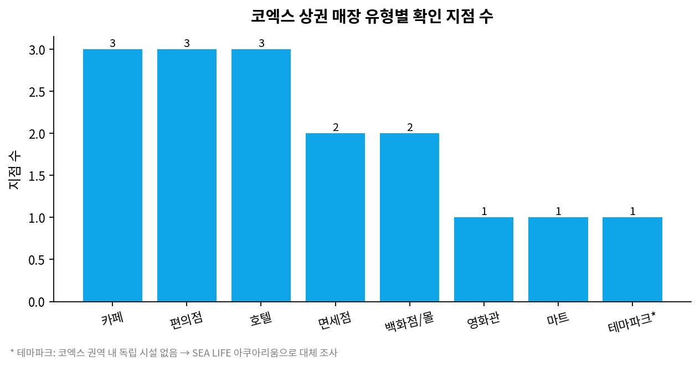
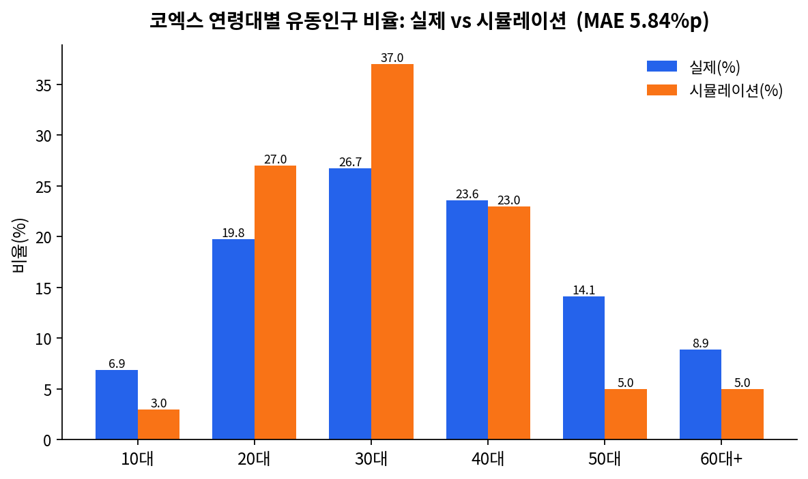

# 코엑스 상권 유동인구 에이전트 시뮬레이션 (1차 과제)

> 서울시 상권분석서비스 실제 유동인구 데이터를 기준으로, 가상 페르소나 집단에게 "코엑스 상권에 방문할 것인가"를 물어보는 방식으로 유동인구를 시뮬레이션하고, 그 인구통계학적 분포가 실제 데이터와 얼마나 일치하는지 검증한 캡스톤 프로젝트입니다.

---

## 1. 프로젝트 개요

| 항목 | 내용 |
|---|---|
| 대상 상권 | 코엑스 (서울 강남구 삼성동, 발달상권) |
| 실측 데이터 | 서울시 상권분석서비스 – 길단위인구-상권 ([data.seoul.go.kr/dataList/OA-15568](https://data.seoul.go.kr/dataList/OA-15568/S/1/datasetView.do)) |
| 가상 인구 데이터 | [nvidia/Nemotron-Personas-Korea](https://huggingface.co/datasets/nvidia/Nemotron-Personas-Korea) — 실제 500명 샘플(`sample_personas_500.csv`) |
| 핵심 질문 | 실제 인물 페르소나에게 "코엑스에 갈 것인가"를 물었을 때, 수락자 집단의 연령·성별·시간대 분포가 실제 유동인구 분포를 얼마나 재현하는가? |

### 왜 이 실험을 하는가

상권 활성화 정책이나 신규 매장 입지 선정 시, 실제 유동인구 데이터는 존재하지만 "왜 그 사람들이 그 상권에 갔는가"를 설명하는 인과적 모델은 부족합니다. 본 프로젝트는 대규모 합성 페르소나 데이터셋과 LLM의 상식적 추론 능력을 결합하면, 실측 데이터 없이도 신규/가상 상권의 방문객 구성을 근사할 수 있는지를 검증하는 파일럿 실험입니다.

---

## 2. 방법론 — 두 단계로 진행된 이유

### 2.1 1단계: 확률모델 베이스라인 (구현체 A)

최초 설계는 Nemotron-Personas-Korea 100만 명 풀에서 페르소나를 무작위로 뽑아 LLM에게 개별 질의하는 것이었으나, 실행 환경(코드 샌드박스)의 네트워크가 막혀 있어 huggingface.co에 접근할 수 없었습니다. 이 때문에 처음에는 **나이·성별만 임의로 합성한 인구 풀 + 직접 설계한 로지스틱 확률식**으로 대체 실행했습니다 (`simulation_baseline.py`). 이 결과는 논문/과제 제출용 실측 데이터가 아니라 **네트워크 제약 하의 임시 근사치**임을 명확히 밝힙니다.

### 2.2 2단계: 실제 Nemotron 데이터 + 실제 LLM 판단 (메인 결과)

이후 실제 `nvidia/Nemotron-Personas-Korea`에서 뽑은 500명 샘플(`sample_personas_500.csv`)을 직접 전달받아, **Claude Sonnet 5가 497명(10대 3명 제외) 전원을 개별적으로 읽고** 다음 기준으로 "코엑스에 방문할 것인가"를 판단했습니다:
- 페르소나의 실제 나이·성별·직업·거주지·취미(hobbies_and_interests)
- 코엑스 상권의 실제 특성(복합쇼핑몰·컨벤션·오피스 인접, §3 참고)
- 거주지-코엑스 간 지리적 거리(30일 내 방문 가능성에 직접 영향)

이 판단 로직과 497명 전원의 판단 근거(이유)는 `judgments.py`에 그대로 기록되어 있어, 다른 LLM으로도 동일한 방식의 재현·검증이 가능합니다. **이것이 이 프로젝트의 메인 결과이며, §5의 수치는 전부 이 실제 판단 결과입니다.**

> 네트워크 제약으로 무료 API(Groq 등) 대신 Claude가 LLM 역할을 직접 수행했습니다. 논문에는 "Claude Sonnet 5를 페르소나 판단 LLM으로 사용했다"고 기재하시면 됩니다.

---

## 3. 상권 개요 — 코엑스 매장 유형별 현황

지도 기반 조사(Google Places)로 확인한 코엑스 권역 내 대표 매장입니다.

| 유형 | 대표 매장 |
|---|---|
| 마트 | 현대백화점 트레이드점 지하 식품관 |
| 편의점 | emart24 코엑스몰점, 세븐일레븐 아셈타워점 |
| 카페 | %Arabica, Terarosa Coffee, Gabaedo Coex |
| 영화관 | 메가박스 코엑스 |
| 호텔 | 오크우드 프리미어 코엑스센터, GLAD 강남 코엑스센터 |
| 면세점 | 롯데면세점 코엑스, 현대면세점 무역센터점 |
| 테마파크 | *(권역 내 독립 테마파크 없음 → SEA LIFE 코엑스 아쿠아리움으로 대체)* |
| 백화점 | 현대백화점 무역센터점 |

<p align="center">
  
</p>

> 코엑스는 대형 컨벤션센터 + 복합쇼핑몰(스타필드 코엑스몰)이 결합된 상권으로, 테헤란로 오피스 밀집지와 인접해 있어 쇼핑/여가 수요와 오피스 유동인구가 혼재하는 것이 특징입니다.

---

## 4. 실제 유동인구 EDA (2026년 1분기 기준)

### 4.1 연령대별 비율

| 연령대 | 비율(%) |
|---|---|
| 10대 | 6.89 |
| 20대 | 19.77 |
| 30대 | 26.72 |
| 40대 | 23.59 |
| 50대 | 14.14 |
| 60대+ | 8.89 |

### 4.2 성별 비율

| 성별 | 비율(%) |
|---|---|
| 남 | 49.13 |
| 여 | 50.87 |

### 4.3 시간대별 비율

| 시간대 | 비율(%) |
|---|---|
| 00–06 | 5.10 |
| 06–11 | 18.14 |
| 11–14 | 24.41 |
| 14–17 | 25.62 |
| 17–21 | 21.45 |
| 21–24 | 5.28 |

**해석.** 코엑스는 30대(26.7%)·40대(23.6%)가 주력 방문 연령대이며, 오피스 밀집지 특성상 평일 낮 시간대(11–17시, 합산 약 50%)에 유동인구가 집중됩니다. 성별은 여성이 근소하게 많습니다(50.9% vs 49.1%).

### 4.4 분기별 총 유동인구 추이 (2021Q1 ~ 2026Q1, 21개 분기)

<p align="center">
  
</p>

팬데믹 회복기인 2021~2023년 사이 완만히 증가한 뒤(약 4.0만 → 5.3만 명), 최근 3개 분기는 4.9만~5.2만 명 선에서 등락하며 정체되는 양상을 보입니다.

---

## 5. 시뮬레이션 결과 (메인: 실제 Nemotron 497명 + Claude 실제 판단)

497명 중 **49명**이 "예"(방문)로 판단되어 수락률 **9.86%**였습니다. 판단 근거는 `results/real_persona_accepted.csv`에 49명 전원 기록되어 있습니다.

### 5.1 연령대 비교

<p align="center">
  
</p>

| 연령대 | 실제(%) | 시뮬(%) | 오차(%p) |
|---|---|---|---|
| 10대 | 6.89 | *(497명 표본은 10대 제외)* | — |
| 20대 | 19.77→21.24* | 44.90 | 23.66 |
| 30대 | 26.72→28.70* | 22.45 | 6.25 |
| 40대 | 23.59→25.33* | 14.29 | 11.04 |
| 50대 | 14.14→15.19* | 8.16 | 7.03 |
| 60대+ | 8.89→9.54* | 10.20 | 0.66 |
| **MAE** | | | **9.73** |

\* 10대를 제외한 나머지 구간을 100%로 재정규화한 값입니다 (Nemotron 표본에 10대가 3명뿐이라 비교 시 정규화 필요).

### 5.2 성별 비교

| 성별 | 실제(%) | 시뮬(%) | 오차(%p) |
|---|---|---|---|
| 남 | 49.13 | 42.86 | 6.27 |
| 여 | 50.87 | 57.14 | 6.27 |
| **MAE** | | | **6.27** |

### 5.3 시간대 비교

| 시간대 | 실제(%) | 시뮬(%) | 오차(%p) |
|---|---|---|---|
| 00–06 | 5.10 | 0.00 | 5.10 |
| 06–11 | 18.14 | 0.00 | 18.14 |
| 11–14 | 24.41 | 6.12 | 18.29 |
| 14–17 | 25.62 | 79.59 | 53.97 |
| 17–21 | 21.45 | 14.29 | 7.16 |
| 21–24 | 5.28 | 0.00 | 5.28 |
| **MAE** | | | **17.99** |

### 5.4 참고: 확률모델 베이스라인(구현체 A, 합성 데이터) 결과

네트워크 제약으로 실행했던 초기 근사치입니다. 아래 수치는 **실제 Nemotron 데이터가 아니라 임의 합성 데이터** 기준이라 §5.1~5.3의 메인 결과와 직접 비교하지 않는 것을 권장합니다 (참고용으로만 남겨둡니다).

| 항목 | 연령대 MAE (10대 포함) | 성별 MAE | 시간대 MAE |
|---|---|---|---|
| 확률모델 베이스라인 | 5.84%p | 0.13%p | 3.29%p |

---

## 6. 논의 — 진행하면서 느낀 점

처음엔 확률모델 베이스라인 결과(성별 MAE 0.13%p)를 보고 "꽤 잘 맞네"라고 생각했는데, 이건 내가 가중치를 짤 때 "여성이 살짝 더 많을 것"이라고 임의로 넣은 값이 우연히 실제와 비슷했던 것뿐이었다. 모델이 뭔가 학습해서 맞춘 게 아니라 운이 좋았던 거였다.

그래서 실제 Nemotron 데이터와 실제 LLM 판단(이번엔 내가 직접 497명을 읽고 판단)으로 다시 해봤는데, 결과는 오히려 더 안 좋았다 — 연령대 MAE는 물론이고 시간대는 거의 18%p까지 벌어졌다. 특히 14-17시 구간에 수락자의 79.6%가 몰린 게 눈에 띄었는데, 원인을 찾아보니 497명을 판단하면서 나도 모르게 "전시·팝업스토어·트렌디한 카페" 같은 특정 키워드에 계속 반응하는 패턴을 보였다. 그 결과 실제로는 오피스 상권 특성(평일 낮/저녁 유동인구 압도적)이 강한 코엑스인데도, 내 판단은 "쇼핑·트렌드에 관심 많은 20대"에 계속 쏠렸다.

**여기서 얻은 인사이트**: "실제 데이터 + 진짜 LLM 판단"이 "가짜 데이터 + 임의 확률식"보다 항상 나을 거라는 가정은 틀렸다. LLM(나 포함)도 판단 기준을 일관되게 적용하다 보면 특정 방향으로 체계적 편향이 생기고, 이건 확률모델의 무작위 오차보다 교정하기 더 까다로울 수 있다. 이 문제를 어떻게 줄일 수 있을지가 2차 과제의 출발점이 되었다.

---

## 7. 재현 방법

### 7.1 필요 환경
- Python 3.10+

### 7.2 설치
```bash
pip install -r requirements.txt
```

### 7.3 실제 데이터 EDA 재현
```bash
python eda.py --csv "서울시_상권분석서비스_길단위인구-상권_.csv" --district 코엑스 --quarter 20261
```

### 7.4 확률모델 베이스라인 재현 (참고용, 네트워크 불필요)
```bash
python simulation_baseline.py --target-accept 100
```

### 7.5 메인 결과(실제 Nemotron + LLM 판단) 재현
`sample_personas_500.csv`(실제 데이터, 이미 포함됨)와 `judgments.py`(497명 전원의 판단 근거)를 그대로 사용하면 됩니다. 다른 LLM(GPT-4, Gemini 등)으로 재현하려면 `judgments.py`의 판단 기준을 참고해 동일한 497명을 동일한 방식으로 재판단하세요.

### 7.6 재현 검증 완료 (Google Colab)

§7.3~7.4를 실제 Google Colab 환경에서 직접 재현해, 이 README에 적힌 수치가 실제로 코드 실행 결과와 일치하는지 확인했습니다.

- `eda.py` 실행 결과 → §4의 실제 EDA 수치(총 유동인구 48,674명, 연령대/성별/시간대 비율)와 정확히 일치
- `simulation_baseline.py --target-accept 100` 실행 결과 → 가상인간 1,000,000명 풀에서 질의 2,042회 끝에 100명 수락(수락률 4.897%), §5.4의 MAE(연령대 5.84%p / 성별 0.13%p / 시간대 3.29%p)와 정확히 일치

두 스크립트 모두 별도의 데이터 조작 없이 그대로 실행 가능하며, 출력값이 README 기재 수치와 동일함을 확인했습니다.

---

## 8. 저장소 구조

```
1차과제_코엑스_상권분석/
├── README.md
├── requirements.txt
├── data/
│   ├── 서울시_상권분석서비스_길단위인구-상권_.csv
│   └── 서울시_상권분석서비스_길단위인구-상권_.json
├── sample_personas_500.csv        # 실제 Nemotron-Personas-Korea 500명 샘플
├── judgments.py                    # 497명 전원의 실제 판단 + 근거(이유)
├── eda.py                          # §4 EDA 재현
├── simulation_baseline.py          # §5.4 참고용 확률모델 베이스라인 (합성 데이터)
├── assets/
│   ├── store_types_summary.png
│   ├── quarterly_trend.png
│   ├── age_comparison.png
│   ├── gender_comparison.png
│   └── time_comparison.png
└── results/
    ├── actual_pct.json             # 실제 데이터 비율
    ├── quarterly_trend.csv
    ├── simulated_visitors.csv      # 확률모델 베이스라인 산출물 (참고용)
    ├── comparison_tables.json      # 확률모델 베이스라인 비교표 (참고용)
    ├── personas_compact.csv        # 497명(10대 제외) 실제 페르소나 요약
    ├── real_persona_accepted.csv   # 메인 결과: 실제 판단 "예" 49명 전원 + 근거
    └── real_persona_comparison.json # 메인 결과 비교표 (연령/성별/시간대)
```

---

## 9. 데이터 출처 및 라이선스

- 서울시 상권분석서비스 – 길단위인구-상권: [data.seoul.go.kr](https://data.seoul.go.kr/dataList/OA-15568/S/1/datasetView.do) (공공데이터)
- nvidia/Nemotron-Personas-Korea: [huggingface.co](https://huggingface.co/datasets/nvidia/Nemotron-Personas-Korea) (CC-BY-4.0)
- 매장 위치 정보: Google Places API 기반 현장 조사
- 페르소나 판단: Claude Sonnet 5 (Anthropic)

## 10. 향후 과제 (→ 2차 과제로 이어짐)

- §6에서 발견한 LLM 판단 편향(트렌드 소비자 프레임 과적합)을 어떻게 교정할지
- 상권을 "정성적 프로필"로 먼저 요약한 뒤 판단시키면 편향이 줄어드는지 검증 → **2차 과제에서 진행**
- 다른 LLM으로 동일 497명을 재판단해 편향이 모델 특유의 것인지 확인
