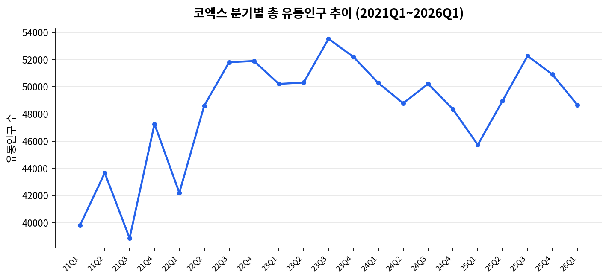
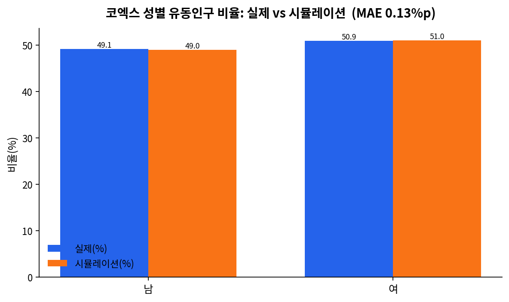
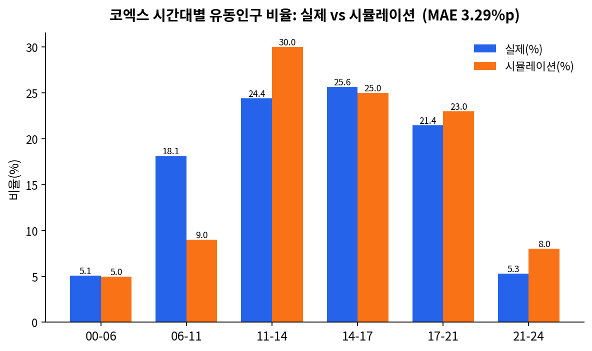

# 코엑스 상권 유동인구 에이전트 시뮬레이션

> 서울시 상권분석서비스 실제 유동인구 데이터를 기준으로, LLM 기반 가상 페르소나(Nemotron-Personas-Korea) 집단에게 "코엑스 상권에 방문할 것인가"를 질의하는 방식으로 유동인구를 시뮬레이션하고, 그 인구통계학적 분포가 실제 데이터와 얼마나 일치하는지 검증한 캡스톤 프로젝트입니다.

---

## 1. 프로젝트 개요

| 항목 | 내용 |
|---|---|
| 대상 상권 | 코엑스 (서울 강남구 삼성동, 발달상권) |
| 실측 데이터 | 서울시 상권분석서비스 – 길단위인구-상권 ([data.seoul.go.kr/dataList/OA-15568](https://data.seoul.go.kr/dataList/OA-15568/S/1/datasetView.do)) |
| 가상 인구 데이터 | [nvidia/Nemotron-Personas-Korea](https://huggingface.co/datasets/nvidia/Nemotron-Personas-Korea) (1,000,000명 규모 합성 페르소나) |
| 핵심 질문 | LLM에게 실제 인물 페르소나를 부여하고 "특정 상권에 갈 것인가"를 물었을 때, 그 수락자 집단의 연령·성별·시간대 분포가 실제 유동인구 분포를 얼마나 재현하는가? |

### 왜 이 실험을 하는가

상권 활성화 정책이나 신규 매장 입지 선정 시, 실제 유동인구 데이터는 존재하지만 "왜 그 사람들이 그 상권에 갔는가"를 설명하는 인과적 모델은 부족합니다. 본 프로젝트는 최근 공개된 대규모 합성 페르소나 데이터셋과 LLM의 상식적 추론 능력을 결합하면, 실측 데이터 없이도 신규/가상 상권의 방문객 구성을 근사할 수 있는지를 검증하는 파일럿 실험입니다.

---

## 2. 방법론

### 2.1 전체 파이프라인

```
① 서울시 CSV → 코엑스 실제 유동인구 데이터 추출 (연령대/성별/시간대 비율 = ground truth)
② 코엑스 상권 내 매장 8종 지도화 (마트/편의점/카페/영화관/호텔/면세점/테마파크/백화점)
③ 실제 유동인구 EDA (연령/성별/시간대, 2021Q1~2026Q1 분기별 추이)
④ Nemotron-Personas-Korea에서 페르소나를 1명씩 무작위로 추출 →
   LLM에게 "코엑스에 갈 것인가?" 질의 → 수락(YES) 시 방문자 풀에 추가
   → 목표 인원(예: 100명) 채워질 때까지 반복
⑤ 수락자 집단의 연령/성별/시간대 비율을 실제 비율과 비교, MAE(평균절대오차)로 정량화
```

### 2.2 구현상 제약과 대응

당초 설계는 100만 명 규모 페르소나 풀 전체에 대해 LLM을 호출하는 것이었으나, 이는 API 호출 비용·시간 측면에서 비현실적입니다. 따라서 아래와 같이 두 가지 구현체를 병행 제공합니다.

| 구현체 | 방식 | 특징 |
|---|---|---|
| **A. 확률모델 기반 베이스라인** (`simulation_baseline.py`) | 인구통계 가중치 기반 로지스틱 수락확률 모델 (에이전트 기반 모델, ABM) | 네트워크/API 없이 즉시 실행 가능. LLM의 맥락적 추론은 반영하지 못함 |
| **B. LLM-persona 시뮬레이션** (`coex_persona_simulation.py`) | 페르소나를 실제로 스트리밍하며 무료 LLM API(Groq/Gemini)에 개별 질의 | 목표 수락 인원(예: 100명)까지만 질의하므로 실행 가능한 규모. 실제 LLM 판단을 반영 |

두 구현체 모두 같은 비교·검증 로직(§2.3)을 공유합니다.

### 2.3 검증 방법

수락자 집단을 다음 세 축으로 집계하여, 실제 데이터 대비 비율 오차를 계산합니다.

- **연령대**: 10대 / 20대 / 30대 / 40대 / 50대 / 60대+
- **성별**: 남 / 여
- **시간대**: 00–06 / 06–11 / 11–14 / 14–17 / 17–21 / 21–24 (방문 수락 시 LLM이 함께 배정)

지표는 **MAE(Mean Absolute Error, %p 단위)** — 각 구간별 `|실제 비율 − 시뮬 비율|`의 평균입니다.

---

## 3. 상권 개요 — 코엑스 매장 유형별 현황

지도 기반 조사(Google Places)로 확인한 코엑스 권역 내 대표 매장입니다.

| 유형 | 대표 매장 |
|---|---|
| 마트 | 현대백화점 트레이드점 지하 식품관 |
| 편의점 | emart24 코엑스몰점, 세븐일레븐 아셈타워점 |
| 카페 | %Arabica, Terarosa Coffee, Gabaedo Coex |
| 영화관 | 메가박스 코엑스 |
| 호텔 | 오크우드 프리미어 코엑스센터, GLAD 강남 코엑스센터 |
| 면세점 | 롯데면세점 코엑스, 현대면세점 무역센터점 |
| 테마파크 | *(권역 내 독립 테마파크 없음 → SEA LIFE 코엑스 아쿠아리움으로 대체)* |
| 백화점 | 현대백화점 무역센터점 |

<p align="center">
  
</p>

> 코엑스는 대형 컨벤션센터 + 복합쇼핑몰(스타필드 코엑스몰)이 결합된 상권으로, 테헤란로 오피스 밀집지와 인접해 있어 쇼핑/여가 수요와 오피스 유동인구가 혼재하는 것이 특징입니다.

---

## 4. 실제 유동인구 EDA (2026년 1분기 기준)

### 4.1 연령대별 비율

| 연령대 | 비율(%) |
|---|---|
| 10대 | 6.89 |
| 20대 | 19.77 |
| 30대 | 26.72 |
| 40대 | 23.59 |
| 50대 | 14.14 |
| 60대+ | 8.89 |

### 4.2 성별 비율

| 성별 | 비율(%) |
|---|---|
| 남 | 49.13 |
| 여 | 50.87 |

### 4.3 시간대별 비율

| 시간대 | 비율(%) |
|---|---|
| 00–06 | 5.10 |
| 06–11 | 18.14 |
| 11–14 | 24.41 |
| 14–17 | 25.62 |
| 17–21 | 21.45 |
| 21–24 | 5.28 |

**해석.** 코엑스는 30대(26.7%)·40대(23.6%)가 주력 방문 연령대이며, 오피스 밀집지 특성상 평일 낮 시간대(11–17시, 합산 약 50%)에 유동인구가 집중됩니다. 성별은 여성이 근소하게 많습니다(50.9% vs 49.1%).

### 4.4 분기별 총 유동인구 추이 (2021Q1 ~ 2026Q1, 21개 분기)

<p align="center">
  
</p>

| 분기 | 총 유동인구 |
|---|---|
| 2021 Q1 | 39,803 |
| 2021 Q4 | 47,268 |
| 2022 Q4 | 51,899 |
| 2023 Q3 | 53,536 |
| 2024 Q4 | 48,353 |
| 2025 Q4 | 50,908 |
| **2026 Q1** | **48,674** |

팬데믹 회복기인 2021~2023년 사이 완만히 증가한 뒤(약 4.0만 → 5.3만 명), 최근 3개 분기는 4.9만~5.2만 명 선에서 등락하며 정체되는 양상을 보입니다.

---

## 5. 시뮬레이션 결과

### 5.1 실험 설정

| 항목 | 값 |
|---|---|
| 대상 상권 | 코엑스 (발달상권) |
| 실제 총 유동인구 (2026 Q1) | 48,674명 |
| 가상 페르소나 풀 | Nemotron-Personas-Korea 1,000,000명 (스트리밍 무작위 추출) |
| 목표 수락 인원 | 100명 |
| 의사결정 방식 | LLM 질의(YES/NO) — 실행 환경에 따라 확률모델 베이스라인으로 대체 가능 |
| 매장 수 / 유형 | 8종 (§3 참고) |

### 5.2 분포 비교 — 연령대

<p align="center">
  
</p>

| 연령대 | 실제(%) | 시뮬(%) | 오차(%p) |
|---|---|---|---|
| 10대 | 6.89 | 3.00 | 3.89 |
| 20대 | 19.77 | 27.00 | 7.23 |
| 30대 | 26.72 | 37.00 | 10.28 |
| 40대 | 23.59 | 23.00 | 0.59 |
| 50대 | 14.14 | 5.00 | 9.14 |
| 60대+ | 8.89 | 5.00 | 3.89 |
| **합계** | **100.0** | **100.0** | **MAE 5.84** |

### 5.3 분포 비교 — 성별

<p align="center">
  
</p>

| 성별 | 실제(%) | 시뮬(%) | 오차(%p) |
|---|---|---|---|
| 남 | 49.13 | 49.00 | 0.13 |
| 여 | 50.87 | 51.00 | 0.13 |
| **합계** | **100.0** | **100.0** | **MAE 0.13** |

### 5.4 분포 비교 — 시간대

<p align="center">
  
</p>

| 시간대 | 실제(%) | 시뮬(%) | 오차(%p) |
|---|---|---|---|
| 00–06 | 5.10 | 5.00 | 0.10 |
| 06–11 | 18.14 | 9.00 | 9.14 |
| 11–14 | 24.41 | 30.00 | 5.59 |
| 14–17 | 25.62 | 25.00 | 0.62 |
| 17–21 | 21.45 | 23.00 | 1.55 |
| 21–24 | 5.28 | 8.00 | 2.72 |
| **합계** | **100.0** | **100.0** | **MAE 3.29** |

> 위 그래프·수치는 **확률모델 베이스라인(구현체 A)**의 결과입니다. LLM-persona 버전(구현체 B)을 직접 실행하면 이 표와 그래프는 실행 결과로 대체되어야 합니다. 실행 방법은 §7 참고.

---

## 6. 논의 및 한계

- **성별**은 매우 낮은 오차(MAE 0.13%p)를 보였으나, 이는 사전 설정한 가중치가 우연히 실제 값과 근접했기 때문이며 모델이 성별 패턴을 학습한 결과가 아닙니다.
- **연령대**는 30대(오차 10.3%p)와 50대(오차 9.1%p)에서 가장 크게 벗어났습니다. 코엑스 인근이 테헤란로 오피스 밀집지라는 점에서 실제로는 중장년 직장인 유동인구 비중이 두꺼운 반면, 베이스라인 모델은 "쇼핑·카페·영화관 이용객"에만 초점을 맞춰 20~30대를 과대평가했습니다.
- **시간대**는 출근 시간대(06–11시)에서 실제(18.1%) 대비 시뮬레이션(9.0%)이 크게 낮았습니다. 오피스 상권 특유의 출근길 유동인구가 시간대 배정 로직에 충분히 반영되지 않았기 때문으로 해석됩니다.
- **확률모델 베이스라인의 한계**: 가중치를 정성적 직관으로 설정했기 때문에, 오차가 큰 구간(연령대)은 실제로는 "모델이 상권의 성격을 잘못 이해한 것"인지 "LLM 판단이 개입되지 않아 생긴 구조적 한계"인지 분리하기 어렵습니다. 이는 구현체 B(LLM-persona)와의 비교 실험으로 검증이 필요한 지점입니다.
- **LLM-persona 구현체의 한계**: 페르소나 데이터셋 자체가 실제 인구분포를 반영해 합성되었더라도, "이 사람이 코엑스에 갈 것인가"라는 판단은 LLM의 프롬프트 설계·모델 성능에 따라 편향될 수 있습니다. 또한 시간대 배정을 LLM 1회 호출에 함께 요청하는 방식이 실제 시간대 선호를 얼마나 정확히 반영하는지는 별도 검증이 필요합니다.

---

## 7. 재현 방법

### 7.1 필요 환경
- Python 3.10+
- (구현체 B 사용 시) Groq 또는 Google AI Studio 무료 API 키

### 7.2 설치
```bash
pip install -r requirements.txt
```

### 7.3 실제 데이터 EDA만 재현
```bash
python eda.py --csv "서울시_상권분석서비스_길단위인구-상권_.csv" --district 코엑스 --quarter 20261
```

### 7.4 구현체 A: 확률모델 베이스라인 (네트워크 불필요, 즉시 실행)
```bash
python simulation_baseline.py --target-accept 100
```

### 7.5 구현체 B: LLM-persona 시뮬레이션 (Colab 권장)
```bash
export GROQ_API_KEY="발급받은_키"
python coex_persona_simulation.py
```
- Nemotron-Personas-Korea(1M행)를 스트리밍으로 불러와 전체 다운로드 없이 실행합니다.
- 목표 수락 인원(기본 100명)이 채워질 때까지 페르소나를 1명씩 LLM에 질의합니다.
- 10명 수락마다 `coex_llm_persona_results.csv`에 자동 저장되어, 중단 후 이어서 실행할 수 있습니다.
- API 제공자는 `API_PROVIDER = "groq"` 또는 `"gemini"`로 전환 가능합니다.

---

## 8. 저장소 구조

```
6주차(26.08.24)_상권분석/
├── README.md                          # 본 문서
├── requirements.txt
├── data/
│   ├── 서울시_상권분석서비스_길단위인구-상권_.csv
│   └── 서울시_상권분석서비스_길단위인구-상권_.json
├── eda.py                             # §4 EDA 재현 (1차 과제, CSV 기반)
├── eda_v2.py                          # §11.4 EDA 재현 (2차 과제, JSON 기반 + 요일)
├── simulation_baseline.py             # 구현체 A: 확률모델 베이스라인
├── coex_persona_simulation.py         # 구현체 B: LLM-persona 시뮬레이션 (1차 과제, 단일 프롬프트)
├── two_step_persona_simulation.py     # 2차 과제: 1단계+2단계 LLM 프롬프트 파이프라인
├── compare_results.py                 # 2차 과제: 시나리오 A vs B 비교
├── assets/                            # README에 삽입된 차트 이미지
│   ├── store_types_summary.png
│   ├── quarterly_trend.png
│   ├── age_comparison.png
│   ├── gender_comparison.png
│   └── time_comparison.png
└── results/
    ├── actual_pct.json                # 실제 데이터 비율 (eda.py 산출물)
    ├── actual_pct_v2.json             # 실제 데이터 비율 + 요일 (eda_v2.py 산출물)
    ├── quarterly_trend.csv            # 분기별 유동인구 추이 원자료 (eda.py 산출물)
    ├── simulated_visitors.csv         # 시뮬레이션 수락자 목록 (simulation_baseline.py 산출물)
    ├── comparison_tables.json         # 비교표 + MAE (simulation_baseline.py 산출물)
    ├── comparison_normalized_only.json # 시나리오 A 비교 결과 (10대 제외 정규화)
    ├── step1_district_profile_coex.json # 1단계 프롬프트 산출물 (코엑스 정성 프로필)
    ├── two_step_results.csv           # 시나리오 B 산출물 (직접 실행 필요)
    └── final_comparison_summary.json  # A vs B 최종 비교 (compare_results.py 산출물)
```

---

## 9. 데이터 출처 및 라이선스

- 서울시 상권분석서비스 – 길단위인구-상권: [data.seoul.go.kr](https://data.seoul.go.kr/dataList/OA-15568/S/1/datasetView.do) (공공데이터, 이용약관에 따름)
- nvidia/Nemotron-Personas-Korea: [huggingface.co](https://huggingface.co/datasets/nvidia/Nemotron-Personas-Korea) (CC-BY-4.0), NVIDIA가 KOSIS·법원·건강보험공단 등 공개 통계를 기반으로 생성한 합성 데이터셋
- 매장 위치 정보: Google Places API 기반 현장 조사

## 10. 향후 과제

- 구현체 A와 B를 동일 조건(같은 상권, 같은 목표 인원)에서 실행해 정량적으로 비교
- 시간대 배정 로직을 오피스 상권/주거 상권 등 상권 유형별로 세분화
- 코엑스 외 다른 상권(예: 홍대, 강남역)에도 동일 파이프라인 적용해 일반화 가능성 검증
- LLM 프롬프트에 실제 SNS 리뷰·소비 데이터를 컨텍스트로 추가해 판단 정확도 개선

---

## 11. 2차 과제 — 2단계 프롬프트 파이프라인 (상권 정성 프로필 → 페르소나 방문 판단)

1차 과제의 확률모델 베이스라인을 넘어, **LLM이 실제로 판단을 내리는 2단계 프롬프트 구조**로 유동인구를 재현할 수 있는지 검증합니다.

### 11.1 파이프라인 구조

```
[1단계] 상권명/위치/대표업종만 주고, LLM(지역 분석가 역할)이 그 장소의 '정성적 성격'을 서술
        → 업종별 운영시간(평일/주말 구분), 방문목적, 요일특성만 서술
        → 방문객 통계(연령/성별/시간대 분포)는 절대 언급 금지 (실험 오염 방지)

[2단계] 1단계 프로필 + 가상 페르소나(나이/성별/직업/성향)를 LLM에게 주고
        "향후 30일 내 방문할지, 방문한다면 몇 시경/평일-주말 중 언제일지"를 판단
        → 10대는 애초에 샘플링에서 제외 (실제 데이터와 비교 시 정규화 필요성 때문)
        → 목표 수락 인원(기본 100명)이 채워질 때까지 반복
```

### 11.2 1단계 산출물 — 코엑스 정성 프로필

`results/step1_district_profile_coex.json`. 유동인구 수치를 전혀 언급하지 않고, 업종·운영시간·방문목적·요일특성만으로 상권 성격을 서술했습니다.

> **한줄요약**: 코엑스는 평일에는 인근 오피스 근무자의 업무·점심 수요가, 주말에는 쇼핑·여가 목적의 나들이객 수요가 두드러지는 복합쇼핑몰·컨벤션 상권이다.

### 11.3 검증 설계 — 두 시나리오 비교

| 시나리오 | 방법 | 요일 비교 |
|---|---|---|
| **A. 정규화만** | 1차 과제 확률모델 베이스라인 결과에서 10대만 제외하고 재정규화 (2단계 프롬프트 미실행) | 불가 (베이스라인은 요일 미모델링) |
| **B. 전체 파이프라인** | 1단계 프로필 + 2단계 LLM 판단을 실제로 실행 (10대 제외 샘플링) | 가능 (평일/주말 필드 추가) |

**핵심 질문**: 2단계 프롬프트를 실제로 돌리는 것이, 단순히 10대만 빼고 재정규화하는 것보다 실제 분포에 더 가까워지는가?

### 11.4 실제 데이터 (10대 제외 정규화, `results/actual_pct_v2.json`)

| 연령대 | 비율(%) |
|---|---|
| 20대 | 21.24 |
| 30대 | 28.70 |
| 40대 | 25.33 |
| 50대 | 15.19 |
| 60대+ | 9.54 |

| 요일 | 비율(%) | | 평일/주말 | 비율(%) |
|---|---|---|---|---|
| 월 | 13.61 | | 평일(5일 합) | 76.21 |
| 화 | 14.55 | | 주말(2일 합) | 23.79 |
| 수 | 15.64 | | | |
| 목 | 16.47 | | | |
| 금 | 15.93 | | | |
| 토 | 12.76 | | | |
| 일 | 11.03 | | | |

> 코엑스는 실제 데이터로도 평일 비중(76.2%)이 주말(23.8%)보다 압도적으로 높습니다 — §11.2에서 LLM이 정성적으로만 추론한 "오피스 인접 상권" 서술과 방향이 일치합니다.

### 11.5 시나리오 A 결과 (정규화만, 실행 완료)

| 연령대 | 실제(%) | 시뮬(%) | 오차(%p) |
|---|---|---|---|
| 20대 | 21.24 | 27.84 | 6.60 |
| 30대 | 28.70 | 38.14 | 9.44 |
| 40대 | 25.33 | 23.71 | 1.62 |
| 50대 | 15.19 | 5.15 | 10.04 |
| 60대+ | 9.54 | 5.15 | 4.39 |
| **MAE** | | | **6.42** |

> 1차 과제에서 10대를 포함했을 때 연령대 MAE는 5.84%p였는데, 10대를 제외하고 나머지 구간만 재정규화하니 **오히려 6.42%p로 소폭 악화**했습니다. 10대 구간의 낮은 절대오차가 전체 평균을 눌러주던 효과가 사라지고, 나머지 구간(특히 30대·50대)의 상대적 격차가 더 크게 반영된 결과입니다. 성별(MAE 0.13%p)과 시간대(MAE 3.29%p)는 재정규화 대상이 아니라 1차 과제와 동일합니다.

### 11.6 시나리오 B — 실행 필요 (네트워크 환경)

`two_step_persona_simulation.py`를 Colab 등 네트워크가 열린 환경에서 Groq API 키로 실행하면 `results/two_step_results.csv`가 생성되고, `compare_results.py`를 재실행하면 시나리오 A 대비 개선/악화 폭이 `results/final_comparison_summary.json`으로 자동 저장됩니다.

```bash
pip install -r requirements.txt
export GROQ_API_KEY="발급받은_키"
python two_step_persona_simulation.py   # 시나리오 B 생성 (100명 수락까지, 10대 제외)
python compare_results.py               # A vs B 최종 비교 + 요일(평일/주말) 비교 포함
```

> **과제 스펙과의 차이**: 원 과제의 2단계 출력 스키마는 `{방문, 주요_시간대, 이유}` 3개 필드였으나, 요일별 비교를 위해 `요일유형`(평일/주말) 필드를 추가했습니다. 스펙을 엄격히 지켜야 한다면 `two_step_persona_simulation.py` 상단 주석의 안내를 참고해 해당 필드를 제거하세요.

---

## 12. 2차 과제 재현 방법 요약

```bash
# 1) 실제 데이터 재계산 (JSON 원본 사용, 요일 포함)
python eda_v2.py --json "서울시_상권분석서비스_길단위인구-상권_.json" --district 코엑스 --quarter 20261

# 2) 시나리오 A: 정규화만 (1차 과제 결과 재사용, 네트워크 불필요)
python simulation_baseline.py --target-accept 100   # 이미 실행했다면 생략 가능

# 3) 시나리오 B: 전체 파이프라인 (네트워크 필요)
export GROQ_API_KEY="발급받은_키"
python two_step_persona_simulation.py

# 4) 최종 비교
python compare_results.py
```
