# 4컷 턴어라운드 캐릭터 생성 — 16명 페르소나 (10대~80대 이상)

> 실제 `nvidia/Nemotron-Personas-Korea` 형식 페르소나 16명(10대~80대 이상, 남녀 각 1명씩)을 대상으로,
> 정면/오른쪽/왼쪽/뒷모습 4컷 턴어라운드 캐릭터를 생성한 과정과 결과를 정리했다.(2주차 과제에서 작성 및 사용했던 프롬프트를 참고했다.)

---

## 1. 방법론 — 왜 "범용 프롬프트" 대신 "개별 프롬프트"인가

### 1.1 처음 시도: 범용 프롬프트 + CSV 첨부
처음에는 `Universal_SD_Character_Prompt_Grounded_Age_Differentiated_v2` 같은 **범용 프롬프트 하나**를
만들어서, 페르소나 CSV 파일만 갈아끼우면 GPT가 알아서 계산해서 캐릭터를 그려주는 방식을 시도했다.

이 방식의 문제:
- GPT가 CSV를 정확히 읽고 텍스트로는 "19세 여성이네요"라고 맞게 확인해놓고도, **정작 이미지 생성
  단계에서는 그 계산 결과를 무시하고 엉뚱한 캐릭터(예: 전혀 다른 성별·나이)를 그리는 경우**가 반복됐다.
- 16진수 계산처럼 복잡한 중간 단계를 프롬프트 안에 넣을수록, 그 계산 결과가 실제 이미지 생성
  요청으로 넘어가는 과정에서 정보가 누락되는 현상이 있었다.
- 같은 대화창에서 여러 명을 연달아 요청하면, 새로 첨부한 CSV를 무시하고 이전에 만든 캐릭터를
  계속 우려먹는 것으로 보이는 현상도 있었다.

### 1.2 최종 방식: CSV 1개당 프롬프트를 미리 완성해서 전달
그래서 방식을 바꿨다 — **Claude가 각 페르소나의 CSV를 직접 읽고, 그 사람만의 완성된 프롬프트를
미리 다 계산해서 써준 다음**, 그 완성 프롬프트만 GPT에 붙여넣어 이미지 생성을 시켰다.

- 페르소나별 헤어 길이/질감/색/앞머리, 눈 모양/색, 나이대별 의상, 소품을 **uuid 기반 해시 계산으로
  미리 확정**해서 프롬프트 텍스트에 그대로 박아넣는 방식 (`generate_character_prompts.py`)
- GPT는 "계산"을 할 필요 없이 "이미 정해진 조합을 그리기만" 하면 되므로, 정보 누락 없이 훨씬
  안정적으로 페르소나 디테일을 반영했다.

### 1.3 반복하며 발견한 세부 문제와 수정
| 발견한 문제 | 수정 |
|---|---|
| 오른쪽·왼쪽 옆모습이 "거울상"으로 처리되어, 가르마 등 비대칭 헤어가 그대로 반전됨 | 두 옆모습을 거울상이 아니라 **각각 독립적으로 서술** |
| 뒷모습에 정면의 귀(에어팟 낀 채) 모양이 그대로 복붙됨 | "귀는 짧은 머리 구조상 보이는 게 맞지만, 에어팟은 뒤에서 안 보인다"로 **귀와 액세서리를 분리해서 지시** -> 2주차에서 생성했던 캐릭터에서 해당. 이번 이미지들에는 해당사항X |
| 여성 헤어가 전부 웨이브/펌 단발로 몰림 | 길이(단발/중단발/긴머리) × 질감(직모/웨이브/곱슬) × 색을 **독립 계산**하고, "poker-straight (NOT wavy, NOT permed)"처럼 **강한 대비 표현**으로 텍스트 무시 방지 |
| "긴머리"가 실제로는 어깨 살짝 지난 정도로만 나옴 | "waist-length(허리까지)"로 **명확한 길이 기준** 명시 |
| 50대 이상 여성도 허리까지 오는 긴머리로 나옴 | 50세 이상 여성은 **단발/중단발 풀로 제한** |
| 눈 모양이 다 비슷하게(큰 동그란 눈) 나옴 | 모양별로 **괄호 안 구체 묘사 + "NOT ~" 부정 지시** 추가 |
| 눈 색에 "웜헤이즐" 같은 밝은 톤이 있는 게 오히려 좋다는 피드백 | 어두운 톤(다크브라운/에스프레소브라운 등) + **밝은 톤(웜헤이즐) 1종을 의도적으로 포함**해 팔레트 유지 |
| 60대 캐릭터가 20대처럼 보임 | 60세 이상은 **눈가·입가 주름, 처진 턱선을 4컷 모두에 일관되게 나타나도록 명시** |
| 50대 이상 남성도 이마를 덮는 풀뱅 스타일이 나옴 | 50세 이상 남성은 **풀뱅 옵션 제외**, 옆으로 넘긴 앞머리/앞머리 없음 중에서만 |
| 50대 이상 헤어컬러가 흑발/짙은 갈색으로 나와 나이대와 안 어울림 | 50세 이상은 **밝은 애쉬브라운/허니브라운/그레이 계열로 통일** |

### 1.4 재현 방법
```bash
python generate_character_prompts.py --csv combined_16.csv --n 16 --out prompts_16people.txt
```
CSV는 실제 Nemotron-Personas-Korea 형식 필드(uuid, age, sex, occupation, persona,
hobbies_and_interests 등)를 그대로 사용한다. 완성된 프롬프트를 하나씩 GPT(이미지 생성)에
붙여넣으면 된다.

---

## 2. 최종 결과 — 16명 (나이 오름차순)


### 김서윤 — 19세 여자, 무직

<p align="center">
  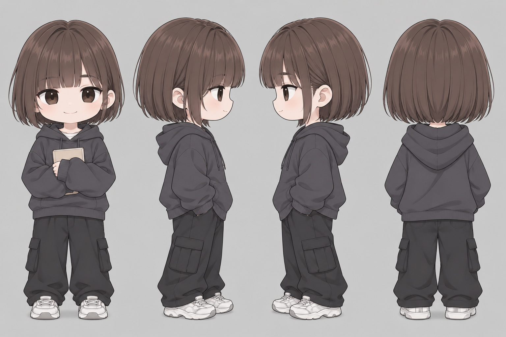
</p>

<details>
<summary>사용한 프롬프트 (펼치기)</summary>

```
A chibi-style anime character reference sheet with four panels arranged in a single
horizontal row, showing the exact same character. Cute super-deformed proportions:
2 heads tall, large round head, big expressive eyes, small simplified body. Clean bold
outlines, soft cel-shading, Korean webtoon/anime illustration style — NOT realistic, NOT
photographic, NOT normal human proportions.

Her hairstyle has full, straight-across bangs that evenly cover most of the forehead — NOT side-swept, NOT parted to one side. There is only a very subtle asymmetry: the fringe sits marginally heavier/lower over her RIGHT eyebrow than her LEFT. This small asymmetry must stay physically consistent across all four panels — it is not something to flip or mirror between panels.

Panel 1 (Front view): she faces directly toward the camera, both eyes visible,
bright, cheerful expression. The full bangs are visible evenly covering most of her forehead, nearly reaching the eyebrows. She has soft monolid eyes (single-eyelid, smooth eyelid with no visible crease/fold, NOT double-eyelid), warm chestnut-brown in color. She is standing with shoulders relaxed and a laid-back stance.
Panel 2 (Right side view): her body is turned so we see her RIGHT
profile — face pointing toward the right edge of the frame, nose pointing right, only
her right eye visible. Since the fringe sits marginally heavier on this side, her right eyebrow is almost entirely hidden beneath the bangs, clearly different from the front view.
Panel 3 (Left side view): her body is turned so we see her LEFT
profile — face pointing toward the left edge of the frame, nose pointing left, only
her left eye visible. Since the fringe is marginally shorter on this side, a sliver of her left eyebrow peeks through beneath the bangs — clearly different from panel 2, not a mirrored copy of it.
Panel 4 (Back view): she faces directly away from the camera, back of head and body
only, no face. Her hair covers most of the back of her head; if any part of the ears is naturally visible due to hairstyle length, show the anatomically correct back-of-ear shape, not the front-of-ear shape reused from panel 1.

Character design: 19-year-old Korean woman, average build,
a chin-length bob (short) poker-straight (NOT wavy, NOT curly, NOT permed) ash brown hair with full, blunt bangs covering most of the forehead. Wearing a baggy charcoal-gray hoodie, wide cargo pants, chunky sneakers. In panel 1 only, she is holding a small paperback book against her chest.

All four panels: identical chibi proportions, identical height, identical outfit, hairstyle,
and eye color/shape (respecting the described asymmetry), plain light gray background, full
body visible head to toe. No text, labels, or watermarks.
```

</details>

### 이민우 — 19세 남자, 무직

<p align="center">
  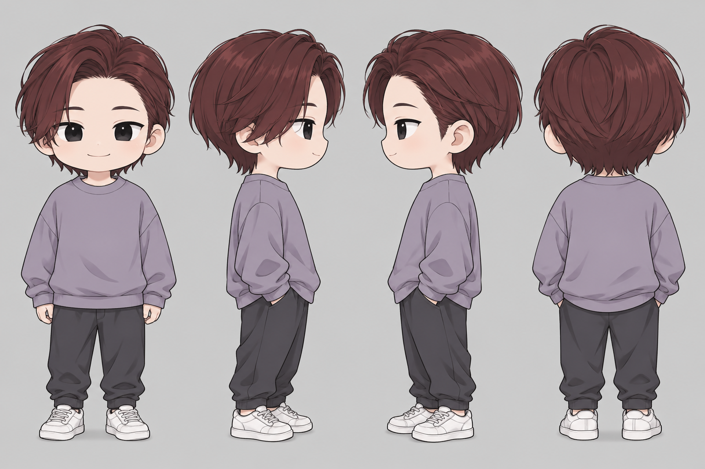
</p>

<details>
<summary>사용한 프롬프트 (펼치기)</summary>

```
A chibi-style anime character reference sheet with four panels arranged in a single
horizontal row, showing the exact same character. Cute super-deformed proportions:
2 heads tall, large round head, big expressive eyes, small simplified body. Clean bold
outlines, soft cel-shading, Korean webtoon/anime illustration style — NOT realistic, NOT
photographic, NOT normal human proportions.

His hair is swept back with a side part: more hair volume falls over his RIGHT ear (partially covering it), while his LEFT ear is more exposed. This asymmetry must stay physically consistent across all four panels — it is not something to flip or mirror between panels.

Panel 1 (Front view): he faces directly toward the camera, both eyes visible,
bright, cheerful expression. Her hair is fully swept back, showing her full forehead, with slightly more volume on the right side. He has soft monolid eyes (single-eyelid, smooth eyelid with no visible crease/fold, NOT double-eyelid), deep black in color. He is standing with shoulders relaxed and a laid-back stance.
Panel 2 (Right side view): his body is turned so we see his RIGHT
profile — face pointing toward the right edge of the frame, nose pointing right, only
his right eye visible. Since more hair falls over this side, his right ear is partially covered by hair strands, clearly different from the front view.
Panel 3 (Left side view): his body is turned so we see his LEFT
profile — face pointing toward the left edge of the frame, nose pointing left, only
his left eye visible. Since his left ear is more exposed, this profile shows the ear clearly, mostly uncovered by hair — clearly different from panel 2, not a mirrored copy of it.
Panel 4 (Back view): he faces directly away from the camera, back of head and body
only, no face. His hair covers most of the back of his head; if any part of the ears is naturally visible due to hairstyle length, show the anatomically correct back-of-ear shape, not the front-of-ear shape reused from panel 1.

Character design: 19-year-old Korean man, average build,
a medium-length poker-straight (NOT wavy, NOT curly, NOT permed) deep auburn hair with no bangs, swept back off the forehead. Wearing an oversized muted lavender crewneck sweatshirt, joggers, white sneakers. In panel 1 only, he is standing with hands relaxed at his sides.

All four panels: identical chibi proportions, identical height, identical outfit, hairstyle,
and eye color/shape (respecting the described asymmetry), plain light gray background, full
body visible head to toe. No text, labels, or watermarks.
```

</details>

### 김보민 — 21세 남자, 무직

<p align="center">
  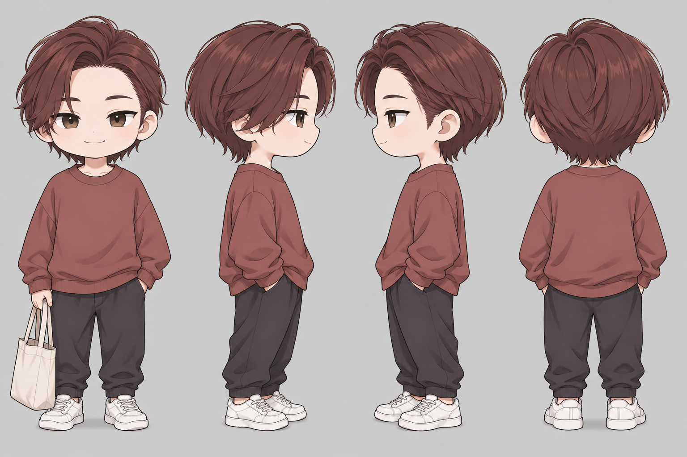
</p>

<details>
<summary>사용한 프롬프트 (펼치기)</summary>

```
A chibi-style anime character reference sheet with four panels arranged in a single
horizontal row, showing the exact same character. Cute super-deformed proportions:
2 heads tall, large round head, big expressive eyes, small simplified body. Clean bold
outlines, soft cel-shading, Korean webtoon/anime illustration style — NOT realistic, NOT
photographic, NOT normal human proportions.

His hair is swept back with a side part: more hair volume falls over his RIGHT ear (partially covering it), while his LEFT ear is more exposed. This asymmetry must stay physically consistent across all four panels — it is not something to flip or mirror between panels.

Panel 1 (Front view): he faces directly toward the camera, both eyes visible,
bright, cheerful expression. Her hair is fully swept back, showing her full forehead, with slightly more volume on the right side. He has elongated almond-shaped eyes (narrower and more angular than round eyes, NOT perfectly circular), warm hazel in color. He is standing with shoulders relaxed and a laid-back stance.
Panel 2 (Right side view): his body is turned so we see his RIGHT
profile — face pointing toward the right edge of the frame, nose pointing right, only
his right eye visible. Since more hair falls over this side, his right ear is partially covered by hair strands, clearly different from the front view.
Panel 3 (Left side view): his body is turned so we see his LEFT
profile — face pointing toward the left edge of the frame, nose pointing left, only
his left eye visible. Since his left ear is more exposed, this profile shows the ear clearly, mostly uncovered by hair — clearly different from panel 2, not a mirrored copy of it.
Panel 4 (Back view): he faces directly away from the camera, back of head and body
only, no face. His hair covers most of the back of his head; if any part of the ears is naturally visible due to hairstyle length, show the anatomically correct back-of-ear shape, not the front-of-ear shape reused from panel 1.

Character design: 21-year-old Korean man, average build,
a medium-length poker-straight (NOT wavy, NOT curly, NOT permed) deep auburn hair with no bangs, swept back off the forehead. Wearing an oversized terracotta crewneck sweatshirt, joggers, white sneakers. In panel 1 only, he is holding a small tote bag.

All four panels: identical chibi proportions, identical height, identical outfit, hairstyle,
and eye color/shape (respecting the described asymmetry), plain light gray background, full
body visible head to toe. No text, labels, or watermarks.
```

</details>

### 김예림 — 27세 여자, 무직

<p align="center">
  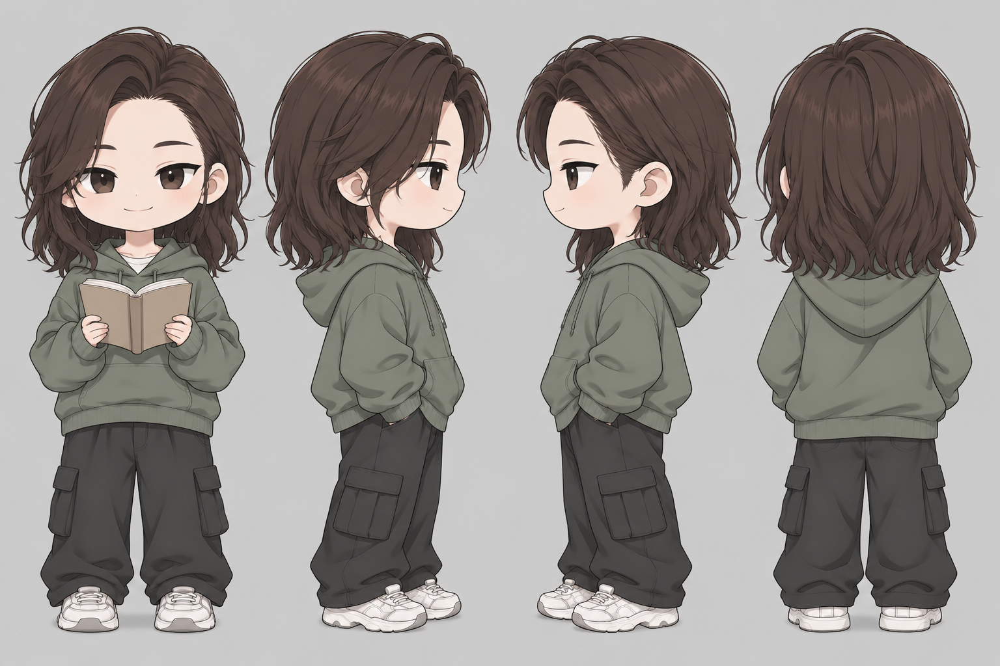
</p>

<details>
<summary>사용한 프롬프트 (펼치기)</summary>

```
A chibi-style anime character reference sheet with four panels arranged in a single
horizontal row, showing the exact same character. Cute super-deformed proportions:
2 heads tall, large round head, big expressive eyes, small simplified body. Clean bold
outlines, soft cel-shading, Korean webtoon/anime illustration style — NOT realistic, NOT
photographic, NOT normal human proportions.

Her hair is swept back with a side part: more hair volume falls over her RIGHT ear (partially covering it), while her LEFT ear is more exposed. This asymmetry must stay physically consistent across all four panels — it is not something to flip or mirror between panels.

Panel 1 (Front view): she faces directly toward the camera, both eyes visible,
bright, cheerful expression. Her hair is fully swept back, showing her full forehead, with slightly more volume on the right side. She has sharp upturned eyes (outer corners angled distinctly upward, cat-eye-like, NOT round or drooping), deep espresso-brown in color. She is standing with shoulders relaxed and a laid-back stance.
Panel 2 (Right side view): her body is turned so we see her RIGHT
profile — face pointing toward the right edge of the frame, nose pointing right, only
her right eye visible. Since more hair falls over this side, her right ear is partially covered by hair strands, clearly different from the front view.
Panel 3 (Left side view): her body is turned so we see her LEFT
profile — face pointing toward the left edge of the frame, nose pointing left, only
her left eye visible. Since her left ear is more exposed, this profile shows the ear clearly, mostly uncovered by hair — clearly different from panel 2, not a mirrored copy of it.
Panel 4 (Back view): she faces directly away from the camera, back of head and body
only, no face. Her hair covers most of the back of her head; if any part of the ears is naturally visible due to hairstyle length, show the anatomically correct back-of-ear shape, not the front-of-ear shape reused from panel 1.

Character design: 27-year-old Korean woman, average build,
a shoulder-length loosely wavy dark brown hair with no bangs, swept back off the forehead. Wearing a baggy sage-green hoodie, wide cargo pants, chunky sneakers. In panel 1 only, she is holding an open book, reading it.

All four panels: identical chibi proportions, identical height, identical outfit, hairstyle,
and eye color/shape (respecting the described asymmetry), plain light gray background, full
body visible head to toe. No text, labels, or watermarks.
```

</details>

### 채다연 — 30세 여자, 음식 서비스 종사원

<p align="center">
  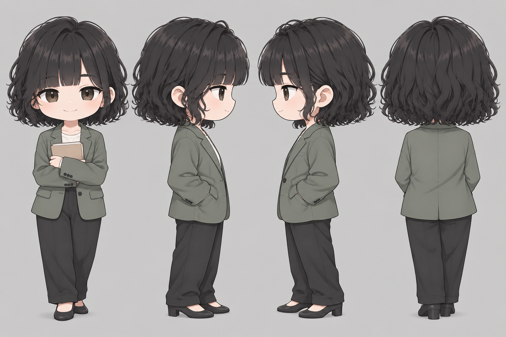
</p>

<details>
<summary>사용한 프롬프트 (펼치기)</summary>

```
[5] 채다연 (0db0407e) — 30세 여자, 음식 서비스 종사원

A chibi-style anime character reference sheet with four panels arranged in a single
horizontal row, showing the exact same character. Cute super-deformed proportions:
2 heads tall, large round head, big expressive eyes, small simplified body. Clean bold
outlines, soft cel-shading, Korean webtoon/anime illustration style — NOT realistic, NOT
photographic, NOT normal human proportions.

Her hairstyle has full, straight-across bangs that evenly cover most of the forehead — NOT side-swept, NOT parted to one side. There is only a very subtle asymmetry: the fringe sits marginally heavier/lower over her RIGHT eyebrow than her LEFT. This small asymmetry must stay physically consistent across all four panels — it is not something to flip or mirror between panels.

Panel 1 (Front view): she faces directly toward the camera, both eyes visible,
bright, cheerful expression. The full bangs are visible evenly covering most of her forehead, nearly reaching the eyebrows. She has gently downturned eyes (outer corners visibly drooping slightly downward, NOT upturned), warm hazel in color. She is standing with weight shifted onto one leg, casual stance.
Panel 2 (Right side view): her body is turned so we see her RIGHT
profile — face pointing toward the right edge of the frame, nose pointing right, only
her right eye visible. Since the fringe sits marginally heavier on this side, her right eyebrow is almost entirely hidden beneath the bangs, clearly different from the front view.
Panel 3 (Left side view): her body is turned so we see her LEFT
profile — face pointing toward the left edge of the frame, nose pointing left, only
her left eye visible. Since the fringe is marginally shorter on this side, a sliver of her left eyebrow peeks through beneath the bangs — clearly different from panel 2, not a mirrored copy of it.
Panel 4 (Back view): she faces directly away from the camera, back of head and body
only, no face. Her hair covers most of the back of her head; if any part of the ears is naturally visible due to hairstyle length, show the anatomically correct back-of-ear shape, not the front-of-ear shape reused from panel 1.

Character design: 30-year-old Korean woman, average build,
a chin-length bob (short) tightly curled/permed jet black hair with full, blunt bangs covering most of the forehead. Wearing a tailored sage-green blazer over a simple top, straight trousers, low heels. In panel 1 only, she is holding a small paperback book against her chest.

All four panels: identical chibi proportions, identical height, identical outfit, hairstyle,
and eye color/shape (respecting the described asymmetry), plain light gray background, full
body visible head to toe. No text, labels, or watermarks.
```

</details>

### 방순호 — 39세 남자, 석유화학 기술자 및 연구원

<p align="center">
  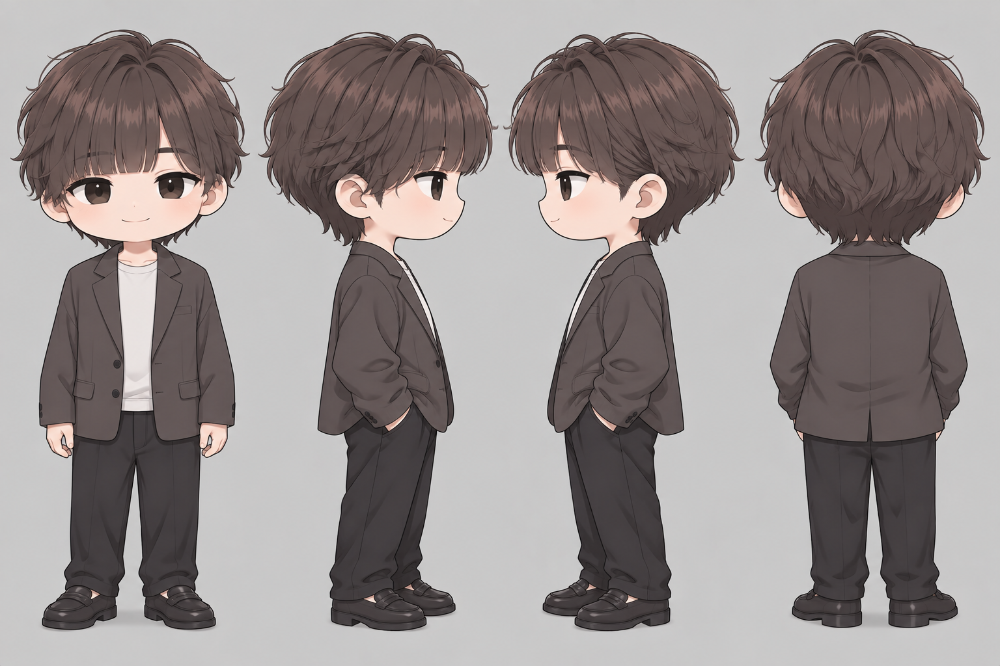
</p>

<details>
<summary>사용한 프롬프트 (펼치기)</summary>

```
[6] 방순호 (78d17274) — 39세 남자, 석유화학 기술자 및 연구원

A chibi-style anime character reference sheet with four panels arranged in a single
horizontal row, showing the exact same character. Cute super-deformed proportions:
2 heads tall, large round head, big expressive eyes, small simplified body. Clean bold
outlines, soft cel-shading, Korean webtoon/anime illustration style — NOT realistic, NOT
photographic, NOT normal human proportions.

His hairstyle has full, straight-across bangs that evenly cover most of the forehead — NOT side-swept, NOT parted to one side. There is only a very subtle asymmetry: the fringe sits marginally heavier/lower over his RIGHT eyebrow than his LEFT. This small asymmetry must stay physically consistent across all four panels — it is not something to flip or mirror between panels.

Panel 1 (Front view): he faces directly toward the camera, both eyes visible,
bright, cheerful expression. The full bangs are visible evenly covering most of his forehead, nearly reaching the eyebrows. He has gently downturned eyes (outer corners visibly drooping slightly downward, NOT upturned), dark brown in color. He is standing with shoulders relaxed and a laid-back stance.
Panel 2 (Right side view): his body is turned so we see his RIGHT
profile — face pointing toward the right edge of the frame, nose pointing right, only
his right eye visible. Since the fringe sits marginally heavier on this side, his right eyebrow is almost entirely hidden beneath the bangs, clearly different from the front view.
Panel 3 (Left side view): his body is turned so we see his LEFT
profile — face pointing toward the left edge of the frame, nose pointing left, only
his left eye visible. Since the fringe is marginally shorter on this side, a sliver of his left eyebrow peeks through beneath the bangs — clearly different from panel 2, not a mirrored copy of it.
Panel 4 (Back view): he faces directly away from the camera, back of head and body
only, no face. His hair covers most of the back of his head; if any part of the ears is naturally visible due to hairstyle length, show the anatomically correct back-of-ear shape, not the front-of-ear shape reused from panel 1.

Character design: 39-year-old Korean man, average build,
a short loosely wavy ash brown hair with full, blunt bangs covering most of the forehead. Wearing a casual blazer over a plain tee, straight trousers, loafers. In panel 1 only, he is standing with hands relaxed at his sides.

All four panels: identical chibi proportions, identical height, identical outfit, hairstyle,
and eye color/shape (respecting the described asymmetry), plain light gray background, full
body visible head to toe. No text, labels, or watermarks.
```

</details>

### 전성일 — 43세 남자, 대리 주차원

<p align="center">
  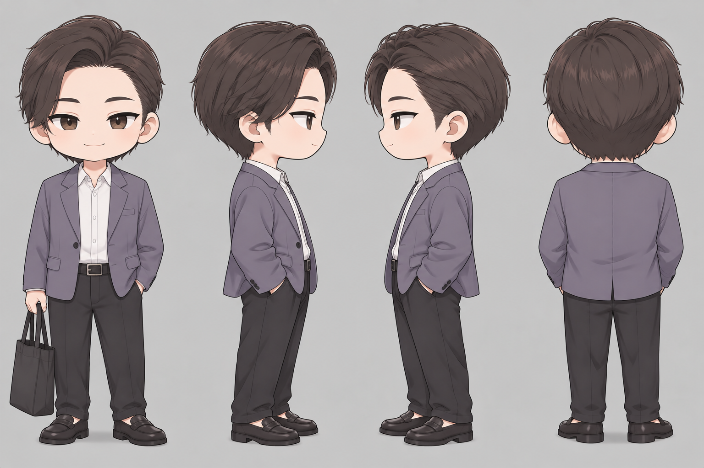
</p>

<details>
<summary>사용한 프롬프트 (펼치기)</summary>

```
[7] 전성일 (23a15009) — 43세 남자, 대리 주차원

A chibi-style anime character reference sheet with four panels arranged in a single
horizontal row, showing the exact same character. Cute super-deformed proportions:
2 heads tall, large round head, big expressive eyes, small simplified body. Clean bold
outlines, soft cel-shading, Korean webtoon/anime illustration style — NOT realistic, NOT
photographic, NOT normal human proportions.

His hair is swept back with a side part: more hair volume falls over his RIGHT ear (partially covering it), while his LEFT ear is more exposed. This asymmetry must stay physically consistent across all four panels — it is not something to flip or mirror between panels.

Panel 1 (Front view): he faces directly toward the camera, both eyes visible,
calm, warm expression. Her hair is fully swept back, showing her full forehead, with slightly more volume on the right side. He has elongated almond-shaped eyes (narrower and more angular than round eyes, NOT perfectly circular), warm hazel in color. He is standing upright with confident, alert posture.
Panel 2 (Right side view): his body is turned so we see his RIGHT
profile — face pointing toward the right edge of the frame, nose pointing right, only
his right eye visible. Since more hair falls over this side, his right ear is partially covered by hair strands, clearly different from the front view.
Panel 3 (Left side view): his body is turned so we see his LEFT
profile — face pointing toward the left edge of the frame, nose pointing left, only
his left eye visible. Since his left ear is more exposed, this profile shows the ear clearly, mostly uncovered by hair — clearly different from panel 2, not a mirrored copy of it.
Panel 4 (Back view): he faces directly away from the camera, back of head and body
only, no face. His hair covers most of the back of his head; if any part of the ears is naturally visible due to hairstyle length, show the anatomically correct back-of-ear shape, not the front-of-ear shape reused from panel 1.

Character design: 43-year-old Korean man, average build,
a very short poker-straight (NOT wavy, NOT curly, NOT permed) dark brown hair with no bangs, swept back off the forehead. Wearing a neat muted lavender blazer, dress shirt, slacks, loafers. In panel 1 only, he is holding a small tote bag.

All four panels: identical chibi proportions, identical height, identical outfit, hairstyle,
and eye color/shape (respecting the described asymmetry), plain light gray background, full
body visible head to toe. No text, labels, or watermarks.
```

</details>

### 김지선 — 47세 여자, 무직

<p align="center">
  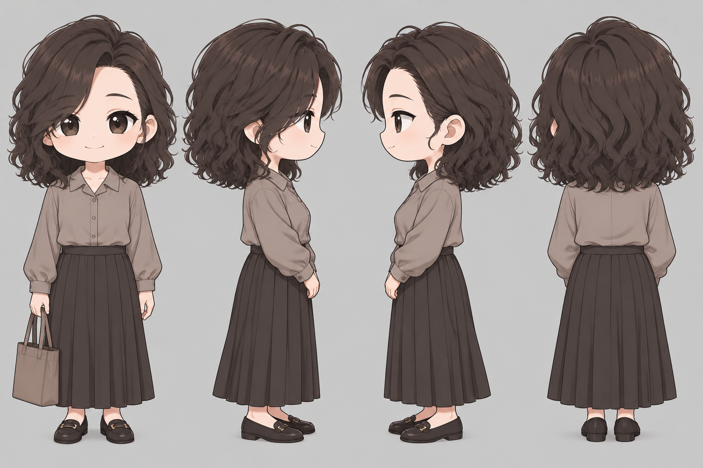
</p>

<details>
<summary>사용한 프롬프트 (펼치기)</summary>

```
A chibi-style anime character reference sheet with four panels arranged in a single
horizontal row, showing the exact same character. Cute super-deformed proportions:
2 heads tall, large round head, big expressive eyes, small simplified body. Clean bold
outlines, soft cel-shading, Korean webtoon/anime illustration style — NOT realistic, NOT
photographic, NOT normal human proportions.

Her hairstyle has a side part with side-swept bangs: more hair covers her RIGHT side of the forehead, and more of her LEFT forehead is visible. This asymmetry must stay physically consistent across all four panels — it is not something to flip or mirror between panels.

Panel 1 (Front view): she faces directly toward the camera, both eyes visible,
calm, warm expression. The side-swept bangs are visible covering more of her right forehead. She has round, wide-open eyes (large circular shape, NOT narrow, NOT slanted), dark brown in color. She is standing straight with a relaxed, friendly posture.
Panel 2 (Right side view): her body is turned so we see her RIGHT
profile — face pointing toward the right edge of the frame, nose pointing right, only
her right eye visible. Since more hair covers this side, her bangs fall low enough to almost completely cover her right eyebrow — barely visible or fully hidden under the hair, clearly different from the front view.
Panel 3 (Left side view): her body is turned so we see her LEFT
profile — face pointing toward the left edge of the frame, nose pointing left, only
her left eye visible. Since more of her left forehead is exposed, this profile shows a cleaner hairline with her left eyebrow fully visible — clearly different from panel 2, not a mirrored copy of it.
Panel 4 (Back view): she faces directly away from the camera, back of head and body
only, no face. Her hair covers most of the back of her head; if any part of the ears is naturally visible due to hairstyle length, show the anatomically correct back-of-ear shape, not the front-of-ear shape reused from panel 1.

Character design: 47-year-old Korean woman, average build,
a shoulder-length tightly curled/permed dark brown hair with side-swept bangs. Wearing a pleated long skirt, a tidy warm taupe blouse with subtle texture (no flashy patterns), flat loafers. In panel 1 only, she is holding a small tote bag.

All four panels: identical chibi proportions, identical height, identical outfit, hairstyle,
and eye color/shape (respecting the described asymmetry), plain light gray background, full
body visible head to toe. No text, labels, or watermarks.
```

</details>

### 고세종 — 58세 남자, 번역가

<p align="center">
  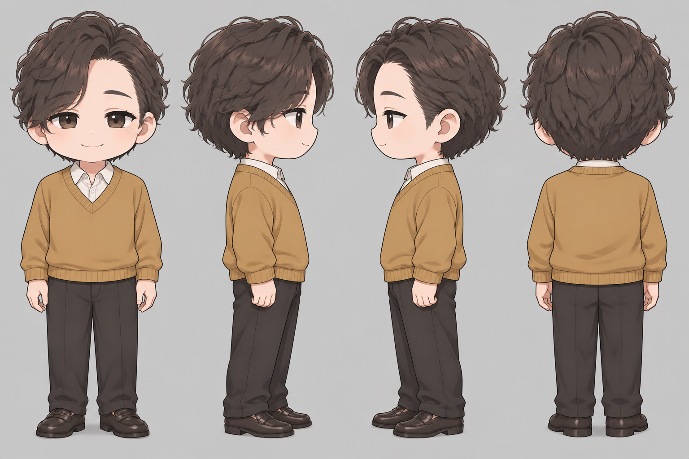
</p>

<details>
<summary>사용한 프롬프트 (펼치기)</summary>

```
A chibi-style anime character reference sheet with four panels arranged in a single
horizontal row, showing the exact same character. Cute super-deformed proportions:
2 heads tall, large round head, big expressive eyes, small simplified body. Clean bold
outlines, soft cel-shading, Korean webtoon/anime illustration style — NOT realistic, NOT
photographic, NOT normal human proportions.

His hairstyle has a side part with side-swept bangs: more hair covers his RIGHT side of the forehead, and more of his LEFT forehead is visible. This asymmetry must stay physically consistent across all four panels — it is not something to flip or mirror between panels.

Panel 1 (Front view): he faces directly toward the camera, both eyes visible,
calm, warm expression. The side-swept bangs are visible covering more of his right forehead. He has gently downturned eyes (outer corners visibly drooping slightly downward, NOT upturned), dark brown in color. He is standing with shoulders relaxed and a laid-back stance.
Panel 2 (Right side view): his body is turned so we see his RIGHT
profile — face pointing toward the right edge of the frame, nose pointing right, only
his right eye visible. Since more hair covers this side, his bangs fall low enough to almost completely cover his right eyebrow — barely visible or fully hidden under the hair, clearly different from the front view.
Panel 3 (Left side view): his body is turned so we see his LEFT
profile — face pointing toward the left edge of the frame, nose pointing left, only
his left eye visible. Since more of his left forehead is exposed, this profile shows a cleaner hairline with his left eyebrow fully visible — clearly different from panel 2, not a mirrored copy of it.
Panel 4 (Back view): he faces directly away from the camera, back of head and body
only, no face. His hair covers most of the back of his head; if any part of the ears is naturally visible due to hairstyle length, show the anatomically correct back-of-ear shape, not the front-of-ear shape reused from panel 1.

Character design: 58-year-old Korean man, average build,
a medium-length tightly curled/permed warm honey brown hair with side-swept bangs. Wearing a warm mustard V-neck knit sweater over a collared shirt, straight trousers, dress shoes. In panel 1 only, he is standing with hands relaxed at his sides.

All four panels: identical chibi proportions, identical height, identical outfit, hairstyle,
and eye color/shape (respecting the described asymmetry), plain light gray background, full
body visible head to toe. No text, labels, or watermarks.
```

</details>

### 이미경 — 59세 여자, 무직

<p align="center">
  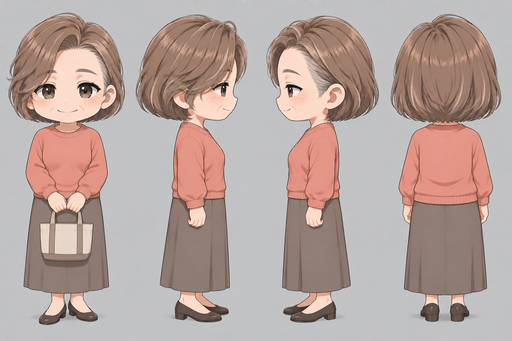
</p>

<details>
<summary>사용한 프롬프트 (펼치기)</summary>

```
A chibi-style anime character reference sheet with four panels arranged in a single
horizontal row, showing the exact same character. Cute super-deformed proportions:
2 heads tall, large round head, big expressive eyes, small simplified body. Clean bold
outlines, soft cel-shading, Korean webtoon/anime illustration style — NOT realistic, NOT
photographic, NOT normal human proportions.

Her hair is swept back with a side part: more hair volume falls over her RIGHT ear (partially covering it), while her LEFT ear is more exposed. This asymmetry must stay physically consistent across all four panels — it is not something to flip or mirror between panels.

Panel 1 (Front view): she faces directly toward the camera, both eyes visible,
calm, warm expression. Her hair is fully swept back, showing her full forehead, with slightly more volume on the right side. She has round, wide-open eyes (large circular shape, NOT narrow, NOT slanted), warm chestnut-brown in color. She is standing with shoulders relaxed and a laid-back stance.
Panel 2 (Right side view): her body is turned so we see her RIGHT
profile — face pointing toward the right edge of the frame, nose pointing right, only
her right eye visible. Since more hair falls over this side, her right ear is partially covered by hair strands, clearly different from the front view.
Panel 3 (Left side view): her body is turned so we see her LEFT
profile — face pointing toward the left edge of the frame, nose pointing left, only
her left eye visible. Since her left ear is more exposed, this profile shows the ear clearly, mostly uncovered by hair — clearly different from panel 2, not a mirrored copy of it.
Panel 4 (Back view): she faces directly away from the camera, back of head and body
only, no face. Her hair covers most of the back of her head; if any part of the ears is naturally visible due to hairstyle length, show the anatomically correct back-of-ear shape, not the front-of-ear shape reused from panel 1.

Character design: 59-year-old Korean woman, average build,
a chin-length bob (short) poker-straight (NOT wavy, NOT curly, NOT permed) warm light brown hair with no bangs, swept back off the forehead. Wearing a straight long skirt, a soft soft coral knit top, low heels. In panel 1 only, she is holding a small tote bag.

All four panels: identical chibi proportions, identical height, identical outfit, hairstyle,
and eye color/shape (respecting the described asymmetry), plain light gray background, full
body visible head to toe. No text, labels, or watermarks.
```

</details>

### 박상윤 — 60세 남자, 무직

<p align="center">
  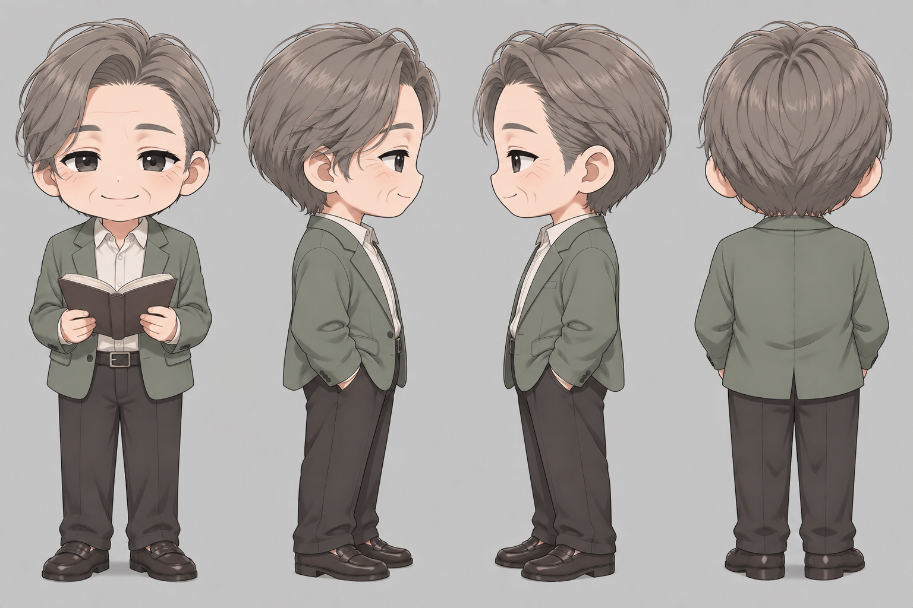
</p>

<details>
<summary>사용한 프롬프트 (펼치기)</summary>

```
A chibi-style anime character reference sheet with four panels arranged in a single
horizontal row, showing the exact same character. Cute super-deformed proportions:
2 heads tall, large round head, big expressive eyes, small simplified body. Clean bold
outlines, soft cel-shading, Korean webtoon/anime illustration style — NOT realistic, NOT
photographic, NOT normal human proportions.

His hair is swept back with a side part: more hair volume falls over his RIGHT ear (partially covering it), while his LEFT ear is more exposed. This asymmetry must stay physically consistent across all four panels — it is not something to flip or mirror between panels.

Panel 1 (Front view): he faces directly toward the camera, both eyes visible,
calm, warm expression. Her hair is fully swept back, showing her full forehead, with slightly more volume on the right side. He has gently downturned eyes (outer corners visibly drooping slightly downward, NOT upturned), deep black in color. He is leaning slightly forward with curious energy. He face clearly shows his age: visible fine wrinkles around the eyes (crow's feet) and mouth (smile lines/nasolabial folds), and a softer, slightly looser jawline than a young adult — this must be visible in all four panels, not just implied. Keep it gentle and consistent with the chibi illustration style, not photorealistic, but the character must NOT look like a young adult in older clothes.
Panel 2 (Right side view): his body is turned so we see his RIGHT
profile — face pointing toward the right edge of the frame, nose pointing right, only
his right eye visible. Since more hair falls over this side, his right ear is partially covered by hair strands, clearly different from the front view.
Panel 3 (Left side view): his body is turned so we see his LEFT
profile — face pointing toward the left edge of the frame, nose pointing left, only
his left eye visible. Since his left ear is more exposed, this profile shows the ear clearly, mostly uncovered by hair — clearly different from panel 2, not a mirrored copy of it.
Panel 4 (Back view): he faces directly away from the camera, back of head and body
only, no face. His hair covers most of the back of his head; if any part of the ears is naturally visible due to hairstyle length, show the anatomically correct back-of-ear shape, not the front-of-ear shape reused from panel 1.

Character design: 60-year-old Korean man, average build,
a short poker-straight (NOT wavy, NOT curly, NOT permed) light ash brown hair with no bangs, swept back off the forehead. Wearing a neat sage-green blazer, dress shirt, slacks, loafers. In panel 1 only, he is holding an open book, reading it.

All four panels: identical chibi proportions, identical height, identical outfit, hairstyle,
and eye color/shape (respecting the described asymmetry), plain light gray background, full
body visible head to toe. No text, labels, or watermarks.
```

</details>

### 이정희 — 69세 여자, 무직

<p align="center">
  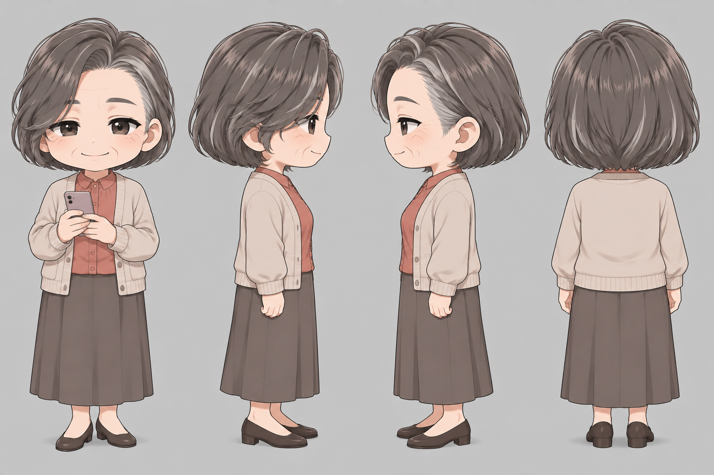
</p>

<details>
<summary>사용한 프롬프트 (펼치기)</summary>

```
A chibi-style anime character reference sheet with four panels arranged in a single
horizontal row, showing the exact same character. Cute super-deformed proportions:
2 heads tall, large round head, big expressive eyes, small simplified body. Clean bold
outlines, soft cel-shading, Korean webtoon/anime illustration style — NOT realistic, NOT
photographic, NOT normal human proportions.

Her hairstyle has a side part with side-swept bangs: more hair covers her RIGHT side of the forehead, and more of her LEFT forehead is visible. This asymmetry must stay physically consistent across all four panels — it is not something to flip or mirror between panels.

Panel 1 (Front view): she faces directly toward the camera, both eyes visible,
calm, warm expression. The side-swept bangs are visible covering more of her right forehead. She has elongated almond-shaped eyes (narrower and more angular than round eyes, NOT perfectly circular), deep espresso-brown in color. She is standing straight with a relaxed, friendly posture. She face clearly shows her age: visible fine wrinkles around the eyes (crow's feet) and mouth (smile lines/nasolabial folds), and a softer, slightly looser jawline than a young adult — this must be visible in all four panels, not just implied. Keep it gentle and consistent with the chibi illustration style, not photorealistic, but the character must NOT look like a young adult in older clothes.
Panel 2 (Right side view): her body is turned so we see her RIGHT
profile — face pointing toward the right edge of the frame, nose pointing right, only
her right eye visible. Since more hair covers this side, her bangs fall low enough to almost completely cover her right eyebrow — barely visible or fully hidden under the hair, clearly different from the front view.
Panel 3 (Left side view): her body is turned so we see her LEFT
profile — face pointing toward the left edge of the frame, nose pointing left, only
her left eye visible. Since more of her left forehead is exposed, this profile shows a cleaner hairline with her left eyebrow fully visible — clearly different from panel 2, not a mirrored copy of it.
Panel 4 (Back view): she faces directly away from the camera, back of head and body
only, no face. Her hair covers most of the back of her head; if any part of the ears is naturally visible due to hairstyle length, show the anatomically correct back-of-ear shape, not the front-of-ear shape reused from panel 1.

Character design: 69-year-old Korean woman, average build,
a chin-length bob (short) poker-straight (NOT wavy, NOT curly, NOT permed) dark brown with gray streaks hair with side-swept bangs. Wearing a below-the-knee A-line skirt in a solid muted color, a simple terracotta blouse (no bold prints), a light cardigan, low block heels. In panel 1 only, she is holding a smartphone, looking at the screen.

All four panels: identical chibi proportions, identical height, identical outfit, hairstyle,
and eye color/shape (respecting the described asymmetry), plain light gray background, full
body visible head to toe. No text, labels, or watermarks.
```

</details>

### 이순영 — 73세 여자, 무직

<p align="center">
  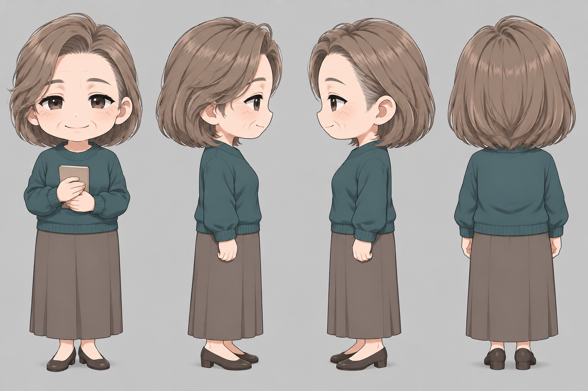
</p>

<details>
<summary>사용한 프롬프트 (펼치기)</summary>

```
A chibi-style anime character reference sheet with four panels arranged in a single
horizontal row, showing the exact same character. Cute super-deformed proportions:
2 heads tall, large round head, big expressive eyes, small simplified body. Clean bold
outlines, soft cel-shading, Korean webtoon/anime illustration style — NOT realistic, NOT
photographic, NOT normal human proportions.

Her hair is swept back with a side part: more hair volume falls over her RIGHT ear (partially covering it), while her LEFT ear is more exposed. This asymmetry must stay physically consistent across all four panels — it is not something to flip or mirror between panels.

Panel 1 (Front view): she faces directly toward the camera, both eyes visible,
calm, warm expression. Her hair is fully swept back, showing her full forehead, with slightly more volume on the right side. She has gently downturned eyes (outer corners visibly drooping slightly downward, NOT upturned), dark brown in color. She is standing upright with confident, alert posture. She face clearly shows her age: visible fine wrinkles around the eyes (crow's feet) and mouth (smile lines/nasolabial folds), and a softer, slightly looser jawline than a young adult — this must be visible in all four panels, not just implied. Keep it gentle and consistent with the chibi illustration style, not photorealistic, but the character must NOT look like a young adult in older clothes.
Panel 2 (Right side view): her body is turned so we see her RIGHT
profile — face pointing toward the right edge of the frame, nose pointing right, only
her right eye visible. Since more hair falls over this side, her right ear is partially covered by hair strands, clearly different from the front view.
Panel 3 (Left side view): her body is turned so we see her LEFT
profile — face pointing toward the left edge of the frame, nose pointing left, only
her left eye visible. Since her left ear is more exposed, this profile shows the ear clearly, mostly uncovered by hair — clearly different from panel 2, not a mirrored copy of it.
Panel 4 (Back view): she faces directly away from the camera, back of head and body
only, no face. Her hair covers most of the back of her head; if any part of the ears is naturally visible due to hairstyle length, show the anatomically correct back-of-ear shape, not the front-of-ear shape reused from panel 1.

Character design: 73-year-old Korean woman, average build,
a shoulder-length (just above the shoulder blades, not longer) poker-straight (NOT wavy, NOT curly, NOT permed) warm honey brown hair with no bangs, swept back off the forehead. Wearing a straight long skirt, a soft deep teal knit top, low heels. In panel 1 only, she is holding a small paperback book against her chest.

All four panels: identical chibi proportions, identical height, identical outfit, hairstyle,
and eye color/shape (respecting the described asymmetry), plain light gray background, full
body visible head to toe. No text, labels, or watermarks.
```

</details>

### 김춘식 — 78세 남자, 인조석 설치원

<p align="center">
  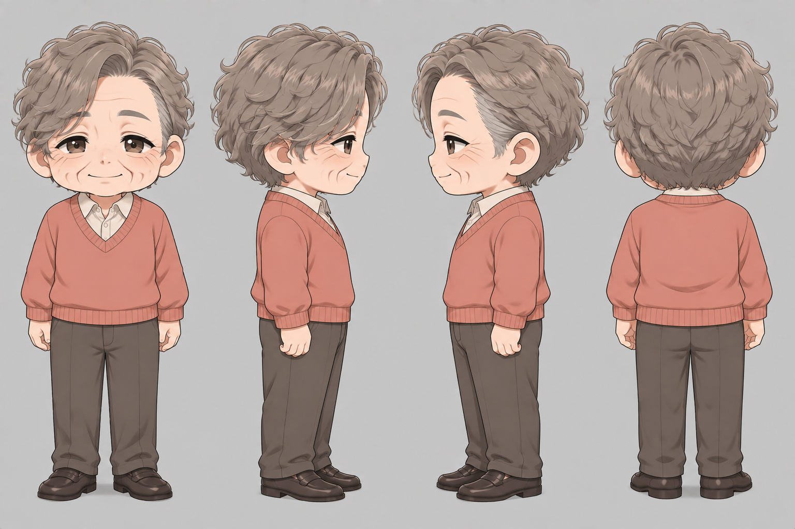
</p>

<details>
<summary>사용한 프롬프트 (펼치기)</summary>

```
[14] 김춘식 (9904d265) — 78세 남자, 인조석 설치원

A chibi-style anime character reference sheet with four panels arranged in a single
horizontal row, showing the exact same character. Cute super-deformed proportions:
2 heads tall, large round head, big expressive eyes, small simplified body. Clean bold
outlines, soft cel-shading, Korean webtoon/anime illustration style — NOT realistic, NOT
photographic, NOT normal human proportions.

His hairstyle has a side part with side-swept bangs: more hair covers his RIGHT side of the forehead, and more of his LEFT forehead is visible. This asymmetry must stay physically consistent across all four panels — it is not something to flip or mirror between panels.

Panel 1 (Front view): he faces directly toward the camera, both eyes visible,
calm, warm expression. The side-swept bangs are visible covering more of his right forehead. He has gently downturned eyes (outer corners visibly drooping slightly downward, NOT upturned), soft caramel-brown in color. He is leaning slightly forward with curious energy. He face clearly shows his age: visible fine wrinkles around the eyes (crow's feet) and mouth (smile lines/nasolabial folds), and a softer, slightly looser jawline than a young adult — this must be visible in all four panels, not just implied. Keep it gentle and consistent with the chibi illustration style, not photorealistic, but the character must NOT look like a young adult in older clothes.
Panel 2 (Right side view): his body is turned so we see his RIGHT
profile — face pointing toward the right edge of the frame, nose pointing right, only
his right eye visible. Since more hair covers this side, his bangs fall low enough to almost completely cover his right eyebrow — barely visible or fully hidden under the hair, clearly different from the front view.
Panel 3 (Left side view): his body is turned so we see his LEFT
profile — face pointing toward the left edge of the frame, nose pointing left, only
his left eye visible. Since more of his left forehead is exposed, this profile shows a cleaner hairline with his left eyebrow fully visible — clearly different from panel 2, not a mirrored copy of it.
Panel 4 (Back view): he faces directly away from the camera, back of head and body
only, no face. His hair covers most of the back of his head; if any part of the ears is naturally visible due to hairstyle length, show the anatomically correct back-of-ear shape, not the front-of-ear shape reused from panel 1.

Character design: 78-year-old Korean man, average build,
a short tightly curled/permed light ash brown hair with side-swept bangs. Wearing a soft coral V-neck knit sweater over a collared shirt, straight trousers, dress shoes. In panel 1 only, he is standing with hands relaxed at his sides.

All four panels: identical chibi proportions, identical height, identical outfit, hairstyle,
and eye color/shape (respecting the described asymmetry), plain light gray background, full
body visible head to toe. No text, labels, or watermarks.
```

</details>

### 홍신수 — 83세 여자, 한식 조리사

<p align="center">
  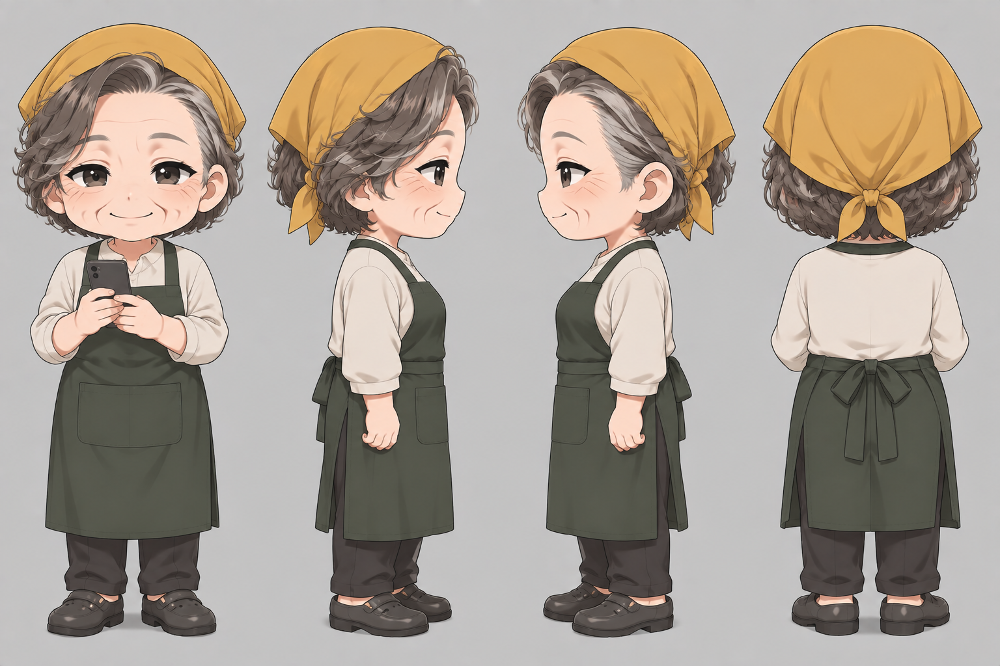
</p>

<details>
<summary>사용한 프롬프트 (펼치기)</summary>

```
[15] 홍신수 (2c3ff2a3) — 83세 여자, 한식 조리사

A chibi-style anime character reference sheet with four panels arranged in a single
horizontal row, showing the exact same character. Cute super-deformed proportions:
2 heads tall, large round head, big expressive eyes, small simplified body. Clean bold
outlines, soft cel-shading, Korean webtoon/anime illustration style — NOT realistic, NOT
photographic, NOT normal human proportions.

Her hair is swept back with a side part: more hair volume falls over her RIGHT ear (partially covering it), while her LEFT ear is more exposed. This asymmetry must stay physically consistent across all four panels — it is not something to flip or mirror between panels.

Panel 1 (Front view): she faces directly toward the camera, both eyes visible,
calm, warm expression. Her hair is fully swept back, showing her full forehead, with slightly more volume on the right side. She has sharp upturned eyes (outer corners angled distinctly upward, cat-eye-like, NOT round or drooping), deep black in color. She is standing upright with confident, alert posture. She face clearly shows her age: visible fine wrinkles around the eyes (crow's feet) and mouth (smile lines/nasolabial folds), and a softer, slightly looser jawline than a young adult — this must be visible in all four panels, not just implied. Keep it gentle and consistent with the chibi illustration style, not photorealistic, but the character must NOT look like a young adult in older clothes.
Panel 2 (Right side view): her body is turned so we see her RIGHT
profile — face pointing toward the right edge of the frame, nose pointing right, only
her right eye visible. Since more hair falls over this side, her right ear is partially covered by hair strands, clearly different from the front view.
Panel 3 (Left side view): her body is turned so we see her LEFT
profile — face pointing toward the left edge of the frame, nose pointing left, only
her left eye visible. Since her left ear is more exposed, this profile shows the ear clearly, mostly uncovered by hair — clearly different from panel 2, not a mirrored copy of it.
Panel 4 (Back view): she faces directly away from the camera, back of head and body
only, no face. Her hair covers most of the back of her head; if any part of the ears is naturally visible due to hairstyle length, show the anatomically correct back-of-ear shape, not the front-of-ear shape reused from panel 1.

Character design: 83-year-old Korean woman, average build,
a chin-length bob (short) tightly curled/permed dark brown with gray streaks hair with no bangs, swept back off the forehead. Wearing a warm mustard chef's bandana, apron over a plain tee, kitchen clogs. In panel 1 only, she is holding a phone, casually checking it.

All four panels: identical chibi proportions, identical height, identical outfit, hairstyle,
and eye color/shape (respecting the described asymmetry), plain light gray background, full
body visible head to toe. No text, labels, or watermarks.
```

</details>

### 조상기 — 89세 남자, 운송장비 청소원

<p align="center">
  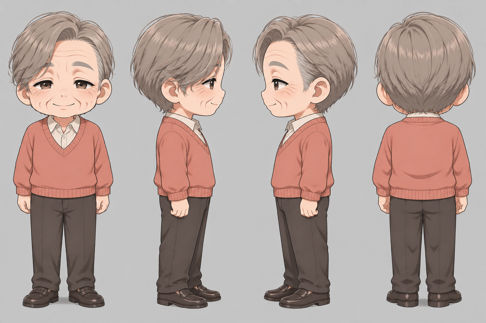
</p>

<details>
<summary>사용한 프롬프트 (펼치기)</summary>

```
[16] 조상기 (ca6ab99f) — 89세 남자, 운송장비 청소원

A chibi-style anime character reference sheet with four panels arranged in a single
horizontal row, showing the exact same character. Cute super-deformed proportions:
2 heads tall, large round head, big expressive eyes, small simplified body. Clean bold
outlines, soft cel-shading, Korean webtoon/anime illustration style — NOT realistic, NOT
photographic, NOT normal human proportions.

His hairstyle has a side part with side-swept bangs: more hair covers his RIGHT side of the forehead, and more of his LEFT forehead is visible. This asymmetry must stay physically consistent across all four panels — it is not something to flip or mirror between panels.

Panel 1 (Front view): he faces directly toward the camera, both eyes visible,
calm, warm expression. The side-swept bangs are visible covering more of his right forehead. He has elongated almond-shaped eyes (narrower and more angular than round eyes, NOT perfectly circular), soft caramel-brown in color. He is standing with shoulders relaxed and a laid-back stance. He face clearly shows his age: visible fine wrinkles around the eyes (crow's feet) and mouth (smile lines/nasolabial folds), and a softer, slightly looser jawline than a young adult — this must be visible in all four panels, not just implied. Keep it gentle and consistent with the chibi illustration style, not photorealistic, but the character must NOT look like a young adult in older clothes.
Panel 2 (Right side view): his body is turned so we see his RIGHT
profile — face pointing toward the right edge of the frame, nose pointing right, only
his right eye visible. Since more hair covers this side, his bangs fall low enough to almost completely cover his right eyebrow — barely visible or fully hidden under the hair, clearly different from the front view.
Panel 3 (Left side view): his body is turned so we see his LEFT
profile — face pointing toward the left edge of the frame, nose pointing left, only
his left eye visible. Since more of his left forehead is exposed, this profile shows a cleaner hairline with his left eyebrow fully visible — clearly different from panel 2, not a mirrored copy of it.
Panel 4 (Back view): he faces directly away from the camera, back of head and body
only, no face. His hair covers most of the back of his head; if any part of the ears is naturally visible due to hairstyle length, show the anatomically correct back-of-ear shape, not the front-of-ear shape reused from panel 1.

Character design: 89-year-old Korean man, average build,
a short poker-straight (NOT wavy, NOT curly, NOT permed) light ash brown hair with side-swept bangs. Wearing a soft coral V-neck knit sweater over a collared shirt, straight trousers, dress shoes. In panel 1 only, he is standing with hands relaxed at his sides.

All four panels: identical chibi proportions, identical height, identical outfit, hairstyle,
and eye color/shape (respecting the described asymmetry), plain light gray background, full
body visible head to toe. No text, labels, or watermarks.
```

</details>

---

## 3. 저장소 구조

```
.
├── README.md
├── generate_character_prompts.py   # 프롬프트 자동 생성 스크립트
├── combined_16.csv                 # 16명 페르소나 원본 데이터 (통합)
└── assets/
    ├── 19_F김서윤.png ~ 89_M조상기.png   (16개 캐릭터 이미지)
```

## 4. 한계

- 같은 프롬프트를 다른 GPT 계정/버전에서 돌리면 그림체·디테일이 미묘하게 달라질 수 있다 (이미지
  생성 모델은 매번 랜덤 시드에서 시작하기 때문). 팀 내에서는 동일 계정(GPT Plus)으로 통일해서
  생성하는 것을 권장한다.
- 눈 모양·색, 헤어 디테일 등은 uuid 해시 기반으로 "그럴듯하게 다양하게" 배정한 것이지, 실제
  Nemotron 데이터셋에 있는 physical description 필드에서 가져온 것은 아니다 (해당 필드가 원본
  데이터셋에 없기 때문).
